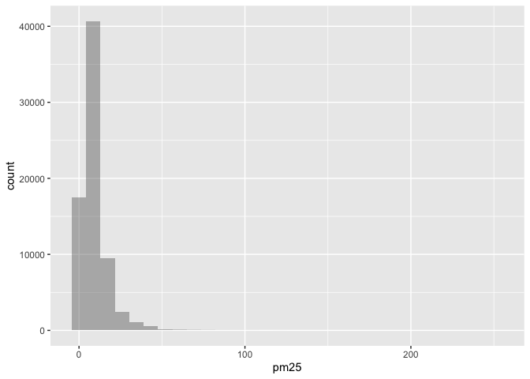
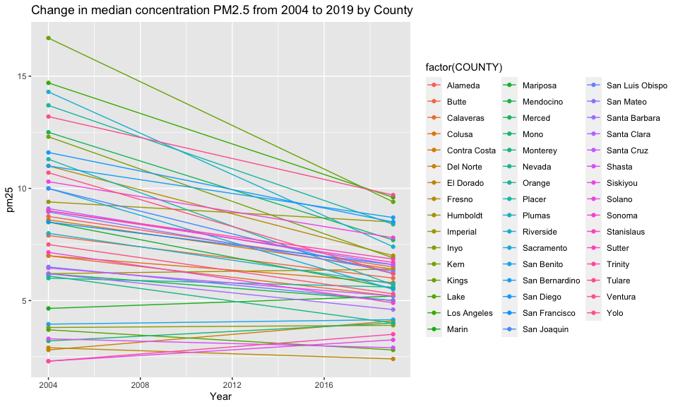
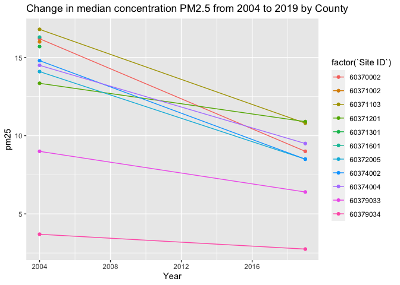

PM566_HW1
================
Yating Zeng
2022-09-23

# Description

Air pollution data from the U.S Environmental Protection Agency (EPA)
were used in this analysis. The primary question answered bellow is
whether daily concentrations of PM2.5 (particulate matter air pollution
with aerodynamic diameter less than 2.5 μm) have decreased in California
over the last 15 years (from 2004 to 2019).

# Step 1. Exploratory Data Analysis

``` r
library(tidyverse)
```

    ## Warning: package 'tidyverse' was built under R version 4.1.2

    ## ── Attaching packages ─────────────────────────────────────── tidyverse 1.3.2 ──
    ## ✔ ggplot2 3.3.5     ✔ purrr   0.3.4
    ## ✔ tibble  3.1.6     ✔ dplyr   1.0.9
    ## ✔ tidyr   1.2.0     ✔ stringr 1.4.0
    ## ✔ readr   2.1.2     ✔ forcats 0.5.2

    ## Warning: package 'tidyr' was built under R version 4.1.2

    ## Warning: package 'readr' was built under R version 4.1.2

    ## Warning: package 'purrr' was built under R version 4.1.2

    ## Warning: package 'dplyr' was built under R version 4.1.2

    ## Warning: package 'forcats' was built under R version 4.1.2

    ## ── Conflicts ────────────────────────────────────────── tidyverse_conflicts() ──
    ## ✖ dplyr::filter() masks stats::filter()
    ## ✖ dplyr::lag()    masks stats::lag()

``` r
library(lubridate)
```

    ## 
    ## Attaching package: 'lubridate'
    ## 
    ## The following objects are masked from 'package:base':
    ## 
    ##     date, intersect, setdiff, union

## Read in the data

``` r
PM2004 <- data.table::fread("ad_viz_plotval_data_2004.csv")
PM2019 <- data.table::fread("ad_viz_plotval_data_2019.csv")
```

## Check the dimensions and headers and footers of the data

``` r
dim(PM2004)
```

    ## [1] 19233    20

``` r
dim(PM2019)
```

    ## [1] 53156    20

``` r
head(PM2004)
```

    ##          Date Source  Site ID POC Daily Mean PM2.5 Concentration    UNITS
    ## 1: 01/01/2004    AQS 60010007   1                           11.0 ug/m3 LC
    ## 2: 01/02/2004    AQS 60010007   1                           12.2 ug/m3 LC
    ## 3: 01/03/2004    AQS 60010007   1                           16.5 ug/m3 LC
    ## 4: 01/04/2004    AQS 60010007   1                           19.5 ug/m3 LC
    ## 5: 01/05/2004    AQS 60010007   1                           11.5 ug/m3 LC
    ## 6: 01/06/2004    AQS 60010007   1                           32.5 ug/m3 LC
    ##    DAILY_AQI_VALUE Site Name DAILY_OBS_COUNT PERCENT_COMPLETE
    ## 1:              46 Livermore               1              100
    ## 2:              51 Livermore               1              100
    ## 3:              60 Livermore               1              100
    ## 4:              67 Livermore               1              100
    ## 5:              48 Livermore               1              100
    ## 6:              94 Livermore               1              100
    ##    AQS_PARAMETER_CODE                     AQS_PARAMETER_DESC CBSA_CODE
    ## 1:              88502 Acceptable PM2.5 AQI & Speciation Mass     41860
    ## 2:              88502 Acceptable PM2.5 AQI & Speciation Mass     41860
    ## 3:              88502 Acceptable PM2.5 AQI & Speciation Mass     41860
    ## 4:              88502 Acceptable PM2.5 AQI & Speciation Mass     41860
    ## 5:              88502 Acceptable PM2.5 AQI & Speciation Mass     41860
    ## 6:              88502 Acceptable PM2.5 AQI & Speciation Mass     41860
    ##                            CBSA_NAME STATE_CODE      STATE COUNTY_CODE  COUNTY
    ## 1: San Francisco-Oakland-Hayward, CA          6 California           1 Alameda
    ## 2: San Francisco-Oakland-Hayward, CA          6 California           1 Alameda
    ## 3: San Francisco-Oakland-Hayward, CA          6 California           1 Alameda
    ## 4: San Francisco-Oakland-Hayward, CA          6 California           1 Alameda
    ## 5: San Francisco-Oakland-Hayward, CA          6 California           1 Alameda
    ## 6: San Francisco-Oakland-Hayward, CA          6 California           1 Alameda
    ##    SITE_LATITUDE SITE_LONGITUDE
    ## 1:      37.68753      -121.7842
    ## 2:      37.68753      -121.7842
    ## 3:      37.68753      -121.7842
    ## 4:      37.68753      -121.7842
    ## 5:      37.68753      -121.7842
    ## 6:      37.68753      -121.7842

``` r
head(PM2019)
```

    ##          Date Source  Site ID POC Daily Mean PM2.5 Concentration    UNITS
    ## 1: 01/01/2019    AQS 60010007   3                            5.7 ug/m3 LC
    ## 2: 01/02/2019    AQS 60010007   3                           11.9 ug/m3 LC
    ## 3: 01/03/2019    AQS 60010007   3                           20.1 ug/m3 LC
    ## 4: 01/04/2019    AQS 60010007   3                           28.8 ug/m3 LC
    ## 5: 01/05/2019    AQS 60010007   3                           11.2 ug/m3 LC
    ## 6: 01/06/2019    AQS 60010007   3                            2.7 ug/m3 LC
    ##    DAILY_AQI_VALUE Site Name DAILY_OBS_COUNT PERCENT_COMPLETE
    ## 1:              24 Livermore               1              100
    ## 2:              50 Livermore               1              100
    ## 3:              68 Livermore               1              100
    ## 4:              86 Livermore               1              100
    ## 5:              47 Livermore               1              100
    ## 6:              11 Livermore               1              100
    ##    AQS_PARAMETER_CODE       AQS_PARAMETER_DESC CBSA_CODE
    ## 1:              88101 PM2.5 - Local Conditions     41860
    ## 2:              88101 PM2.5 - Local Conditions     41860
    ## 3:              88101 PM2.5 - Local Conditions     41860
    ## 4:              88101 PM2.5 - Local Conditions     41860
    ## 5:              88101 PM2.5 - Local Conditions     41860
    ## 6:              88101 PM2.5 - Local Conditions     41860
    ##                            CBSA_NAME STATE_CODE      STATE COUNTY_CODE  COUNTY
    ## 1: San Francisco-Oakland-Hayward, CA          6 California           1 Alameda
    ## 2: San Francisco-Oakland-Hayward, CA          6 California           1 Alameda
    ## 3: San Francisco-Oakland-Hayward, CA          6 California           1 Alameda
    ## 4: San Francisco-Oakland-Hayward, CA          6 California           1 Alameda
    ## 5: San Francisco-Oakland-Hayward, CA          6 California           1 Alameda
    ## 6: San Francisco-Oakland-Hayward, CA          6 California           1 Alameda
    ##    SITE_LATITUDE SITE_LONGITUDE
    ## 1:      37.68753      -121.7842
    ## 2:      37.68753      -121.7842
    ## 3:      37.68753      -121.7842
    ## 4:      37.68753      -121.7842
    ## 5:      37.68753      -121.7842
    ## 6:      37.68753      -121.7842

``` r
tail(PM2004)
```

    ##          Date Source  Site ID POC Daily Mean PM2.5 Concentration    UNITS
    ## 1: 12/14/2004    AQS 61131003   1                             11 ug/m3 LC
    ## 2: 12/17/2004    AQS 61131003   1                             16 ug/m3 LC
    ## 3: 12/20/2004    AQS 61131003   1                             17 ug/m3 LC
    ## 4: 12/23/2004    AQS 61131003   1                              9 ug/m3 LC
    ## 5: 12/26/2004    AQS 61131003   1                             24 ug/m3 LC
    ## 6: 12/29/2004    AQS 61131003   1                              9 ug/m3 LC
    ##    DAILY_AQI_VALUE            Site Name DAILY_OBS_COUNT PERCENT_COMPLETE
    ## 1:              46 Woodland-Gibson Road               1              100
    ## 2:              59 Woodland-Gibson Road               1              100
    ## 3:              61 Woodland-Gibson Road               1              100
    ## 4:              38 Woodland-Gibson Road               1              100
    ## 5:              76 Woodland-Gibson Road               1              100
    ## 6:              38 Woodland-Gibson Road               1              100
    ##    AQS_PARAMETER_CODE       AQS_PARAMETER_DESC CBSA_CODE
    ## 1:              88101 PM2.5 - Local Conditions     40900
    ## 2:              88101 PM2.5 - Local Conditions     40900
    ## 3:              88101 PM2.5 - Local Conditions     40900
    ## 4:              88101 PM2.5 - Local Conditions     40900
    ## 5:              88101 PM2.5 - Local Conditions     40900
    ## 6:              88101 PM2.5 - Local Conditions     40900
    ##                                  CBSA_NAME STATE_CODE      STATE COUNTY_CODE
    ## 1: Sacramento--Roseville--Arden-Arcade, CA          6 California         113
    ## 2: Sacramento--Roseville--Arden-Arcade, CA          6 California         113
    ## 3: Sacramento--Roseville--Arden-Arcade, CA          6 California         113
    ## 4: Sacramento--Roseville--Arden-Arcade, CA          6 California         113
    ## 5: Sacramento--Roseville--Arden-Arcade, CA          6 California         113
    ## 6: Sacramento--Roseville--Arden-Arcade, CA          6 California         113
    ##    COUNTY SITE_LATITUDE SITE_LONGITUDE
    ## 1:   Yolo      38.66121      -121.7327
    ## 2:   Yolo      38.66121      -121.7327
    ## 3:   Yolo      38.66121      -121.7327
    ## 4:   Yolo      38.66121      -121.7327
    ## 5:   Yolo      38.66121      -121.7327
    ## 6:   Yolo      38.66121      -121.7327

``` r
tail(PM2019)
```

    ##          Date Source  Site ID POC Daily Mean PM2.5 Concentration    UNITS
    ## 1: 11/11/2019    AQS 61131003   1                           13.5 ug/m3 LC
    ## 2: 11/17/2019    AQS 61131003   1                           18.1 ug/m3 LC
    ## 3: 11/29/2019    AQS 61131003   1                           12.5 ug/m3 LC
    ## 4: 12/17/2019    AQS 61131003   1                           23.8 ug/m3 LC
    ## 5: 12/23/2019    AQS 61131003   1                            1.0 ug/m3 LC
    ## 6: 12/29/2019    AQS 61131003   1                            9.1 ug/m3 LC
    ##    DAILY_AQI_VALUE            Site Name DAILY_OBS_COUNT PERCENT_COMPLETE
    ## 1:              54 Woodland-Gibson Road               1              100
    ## 2:              64 Woodland-Gibson Road               1              100
    ## 3:              52 Woodland-Gibson Road               1              100
    ## 4:              76 Woodland-Gibson Road               1              100
    ## 5:               4 Woodland-Gibson Road               1              100
    ## 6:              38 Woodland-Gibson Road               1              100
    ##    AQS_PARAMETER_CODE       AQS_PARAMETER_DESC CBSA_CODE
    ## 1:              88101 PM2.5 - Local Conditions     40900
    ## 2:              88101 PM2.5 - Local Conditions     40900
    ## 3:              88101 PM2.5 - Local Conditions     40900
    ## 4:              88101 PM2.5 - Local Conditions     40900
    ## 5:              88101 PM2.5 - Local Conditions     40900
    ## 6:              88101 PM2.5 - Local Conditions     40900
    ##                                  CBSA_NAME STATE_CODE      STATE COUNTY_CODE
    ## 1: Sacramento--Roseville--Arden-Arcade, CA          6 California         113
    ## 2: Sacramento--Roseville--Arden-Arcade, CA          6 California         113
    ## 3: Sacramento--Roseville--Arden-Arcade, CA          6 California         113
    ## 4: Sacramento--Roseville--Arden-Arcade, CA          6 California         113
    ## 5: Sacramento--Roseville--Arden-Arcade, CA          6 California         113
    ## 6: Sacramento--Roseville--Arden-Arcade, CA          6 California         113
    ##    COUNTY SITE_LATITUDE SITE_LONGITUDE
    ## 1:   Yolo      38.66121      -121.7327
    ## 2:   Yolo      38.66121      -121.7327
    ## 3:   Yolo      38.66121      -121.7327
    ## 4:   Yolo      38.66121      -121.7327
    ## 5:   Yolo      38.66121      -121.7327
    ## 6:   Yolo      38.66121      -121.7327

## Check the variable types in the data

``` r
str(PM2004)
```

    ## Classes 'data.table' and 'data.frame':   19233 obs. of  20 variables:
    ##  $ Date                          : chr  "01/01/2004" "01/02/2004" "01/03/2004" "01/04/2004" ...
    ##  $ Source                        : chr  "AQS" "AQS" "AQS" "AQS" ...
    ##  $ Site ID                       : int  60010007 60010007 60010007 60010007 60010007 60010007 60010007 60010007 60010007 60010007 ...
    ##  $ POC                           : int  1 1 1 1 1 1 1 1 1 1 ...
    ##  $ Daily Mean PM2.5 Concentration: num  11 12.2 16.5 19.5 11.5 32.5 14 29.9 21 15.7 ...
    ##  $ UNITS                         : chr  "ug/m3 LC" "ug/m3 LC" "ug/m3 LC" "ug/m3 LC" ...
    ##  $ DAILY_AQI_VALUE               : int  46 51 60 67 48 94 55 88 70 59 ...
    ##  $ Site Name                     : chr  "Livermore" "Livermore" "Livermore" "Livermore" ...
    ##  $ DAILY_OBS_COUNT               : int  1 1 1 1 1 1 1 1 1 1 ...
    ##  $ PERCENT_COMPLETE              : num  100 100 100 100 100 100 100 100 100 100 ...
    ##  $ AQS_PARAMETER_CODE            : int  88502 88502 88502 88502 88502 88502 88101 88502 88502 88101 ...
    ##  $ AQS_PARAMETER_DESC            : chr  "Acceptable PM2.5 AQI & Speciation Mass" "Acceptable PM2.5 AQI & Speciation Mass" "Acceptable PM2.5 AQI & Speciation Mass" "Acceptable PM2.5 AQI & Speciation Mass" ...
    ##  $ CBSA_CODE                     : int  41860 41860 41860 41860 41860 41860 41860 41860 41860 41860 ...
    ##  $ CBSA_NAME                     : chr  "San Francisco-Oakland-Hayward, CA" "San Francisco-Oakland-Hayward, CA" "San Francisco-Oakland-Hayward, CA" "San Francisco-Oakland-Hayward, CA" ...
    ##  $ STATE_CODE                    : int  6 6 6 6 6 6 6 6 6 6 ...
    ##  $ STATE                         : chr  "California" "California" "California" "California" ...
    ##  $ COUNTY_CODE                   : int  1 1 1 1 1 1 1 1 1 1 ...
    ##  $ COUNTY                        : chr  "Alameda" "Alameda" "Alameda" "Alameda" ...
    ##  $ SITE_LATITUDE                 : num  37.7 37.7 37.7 37.7 37.7 ...
    ##  $ SITE_LONGITUDE                : num  -122 -122 -122 -122 -122 ...
    ##  - attr(*, ".internal.selfref")=<externalptr>

``` r
str(PM2019)
```

    ## Classes 'data.table' and 'data.frame':   53156 obs. of  20 variables:
    ##  $ Date                          : chr  "01/01/2019" "01/02/2019" "01/03/2019" "01/04/2019" ...
    ##  $ Source                        : chr  "AQS" "AQS" "AQS" "AQS" ...
    ##  $ Site ID                       : int  60010007 60010007 60010007 60010007 60010007 60010007 60010007 60010007 60010007 60010007 ...
    ##  $ POC                           : int  3 3 3 3 3 3 3 3 3 3 ...
    ##  $ Daily Mean PM2.5 Concentration: num  5.7 11.9 20.1 28.8 11.2 2.7 2.8 7 3.1 7.1 ...
    ##  $ UNITS                         : chr  "ug/m3 LC" "ug/m3 LC" "ug/m3 LC" "ug/m3 LC" ...
    ##  $ DAILY_AQI_VALUE               : int  24 50 68 86 47 11 12 29 13 30 ...
    ##  $ Site Name                     : chr  "Livermore" "Livermore" "Livermore" "Livermore" ...
    ##  $ DAILY_OBS_COUNT               : int  1 1 1 1 1 1 1 1 1 1 ...
    ##  $ PERCENT_COMPLETE              : num  100 100 100 100 100 100 100 100 100 100 ...
    ##  $ AQS_PARAMETER_CODE            : int  88101 88101 88101 88101 88101 88101 88101 88101 88101 88101 ...
    ##  $ AQS_PARAMETER_DESC            : chr  "PM2.5 - Local Conditions" "PM2.5 - Local Conditions" "PM2.5 - Local Conditions" "PM2.5 - Local Conditions" ...
    ##  $ CBSA_CODE                     : int  41860 41860 41860 41860 41860 41860 41860 41860 41860 41860 ...
    ##  $ CBSA_NAME                     : chr  "San Francisco-Oakland-Hayward, CA" "San Francisco-Oakland-Hayward, CA" "San Francisco-Oakland-Hayward, CA" "San Francisco-Oakland-Hayward, CA" ...
    ##  $ STATE_CODE                    : int  6 6 6 6 6 6 6 6 6 6 ...
    ##  $ STATE                         : chr  "California" "California" "California" "California" ...
    ##  $ COUNTY_CODE                   : int  1 1 1 1 1 1 1 1 1 1 ...
    ##  $ COUNTY                        : chr  "Alameda" "Alameda" "Alameda" "Alameda" ...
    ##  $ SITE_LATITUDE                 : num  37.7 37.7 37.7 37.7 37.7 ...
    ##  $ SITE_LONGITUDE                : num  -122 -122 -122 -122 -122 ...
    ##  - attr(*, ".internal.selfref")=<externalptr>

``` r
summary(PM2004)
```

    ##      Date              Source             Site ID              POC        
    ##  Length:19233       Length:19233       Min.   :60010007   Min.   : 1.000  
    ##  Class :character   Class :character   1st Qu.:60370002   1st Qu.: 1.000  
    ##  Mode  :character   Mode  :character   Median :60658001   Median : 1.000  
    ##                                        Mean   :60588026   Mean   : 1.816  
    ##                                        3rd Qu.:60750006   3rd Qu.: 2.000  
    ##                                        Max.   :61131003   Max.   :12.000  
    ##                                                                           
    ##  Daily Mean PM2.5 Concentration    UNITS           DAILY_AQI_VALUE 
    ##  Min.   : -0.10                 Length:19233       Min.   :  0.00  
    ##  1st Qu.:  6.00                 Class :character   1st Qu.: 25.00  
    ##  Median : 10.10                 Mode  :character   Median : 42.00  
    ##  Mean   : 13.12                                    Mean   : 46.33  
    ##  3rd Qu.: 16.30                                    3rd Qu.: 60.00  
    ##  Max.   :251.00                                    Max.   :301.00  
    ##                                                                    
    ##   Site Name         DAILY_OBS_COUNT PERCENT_COMPLETE AQS_PARAMETER_CODE
    ##  Length:19233       Min.   :1       Min.   :100      Min.   :88101     
    ##  Class :character   1st Qu.:1       1st Qu.:100      1st Qu.:88101     
    ##  Mode  :character   Median :1       Median :100      Median :88101     
    ##                     Mean   :1       Mean   :100      Mean   :88268     
    ##                     3rd Qu.:1       3rd Qu.:100      3rd Qu.:88502     
    ##                     Max.   :1       Max.   :100      Max.   :88502     
    ##                                                                        
    ##  AQS_PARAMETER_DESC   CBSA_CODE      CBSA_NAME           STATE_CODE
    ##  Length:19233       Min.   :12540   Length:19233       Min.   :6   
    ##  Class :character   1st Qu.:31080   Class :character   1st Qu.:6   
    ##  Mode  :character   Median :40140   Mode  :character   Median :6   
    ##                     Mean   :35328                      Mean   :6   
    ##                     3rd Qu.:41860                      3rd Qu.:6   
    ##                     Max.   :49700                      Max.   :6   
    ##                     NA's   :1253                                   
    ##     STATE            COUNTY_CODE        COUNTY          SITE_LATITUDE  
    ##  Length:19233       Min.   :  1.00   Length:19233       Min.   :32.63  
    ##  Class :character   1st Qu.: 37.00   Class :character   1st Qu.:34.07  
    ##  Mode  :character   Median : 65.00   Mode  :character   Median :36.48  
    ##                     Mean   : 58.63                      Mean   :36.23  
    ##                     3rd Qu.: 75.00                      3rd Qu.:38.10  
    ##                     Max.   :113.00                      Max.   :41.71  
    ##                                                                        
    ##  SITE_LONGITUDE  
    ##  Min.   :-124.2  
    ##  1st Qu.:-121.6  
    ##  Median :-119.3  
    ##  Mean   :-119.7  
    ##  3rd Qu.:-117.9  
    ##  Max.   :-115.5  
    ## 

``` r
summary(PM2019)
```

    ##      Date              Source             Site ID              POC        
    ##  Length:53156       Length:53156       Min.   :60010007   Min.   : 1.000  
    ##  Class :character   Class :character   1st Qu.:60310004   1st Qu.: 1.000  
    ##  Mode  :character   Mode  :character   Median :60612003   Median : 3.000  
    ##                                        Mean   :60565264   Mean   : 2.573  
    ##                                        3rd Qu.:60771002   3rd Qu.: 3.000  
    ##                                        Max.   :61131003   Max.   :21.000  
    ##                                                                           
    ##  Daily Mean PM2.5 Concentration    UNITS           DAILY_AQI_VALUE 
    ##  Min.   : -2.200                Length:53156       Min.   :  0.00  
    ##  1st Qu.:  4.000                Class :character   1st Qu.: 17.00  
    ##  Median :  6.500                Mode  :character   Median : 27.00  
    ##  Mean   :  7.739                                   Mean   : 30.57  
    ##  3rd Qu.:  9.900                                   3rd Qu.: 41.00  
    ##  Max.   :120.900                                   Max.   :185.00  
    ##                                                                    
    ##   Site Name         DAILY_OBS_COUNT PERCENT_COMPLETE AQS_PARAMETER_CODE
    ##  Length:53156       Min.   :1       Min.   :100      Min.   :88101     
    ##  Class :character   1st Qu.:1       1st Qu.:100      1st Qu.:88101     
    ##  Mode  :character   Median :1       Median :100      Median :88101     
    ##                     Mean   :1       Mean   :100      Mean   :88214     
    ##                     3rd Qu.:1       3rd Qu.:100      3rd Qu.:88502     
    ##                     Max.   :1       Max.   :100      Max.   :88502     
    ##                                                                        
    ##  AQS_PARAMETER_DESC   CBSA_CODE      CBSA_NAME           STATE_CODE
    ##  Length:53156       Min.   :12540   Length:53156       Min.   :6   
    ##  Class :character   1st Qu.:31080   Class :character   1st Qu.:6   
    ##  Mode  :character   Median :40140   Mode  :character   Median :6   
    ##                     Mean   :35839                      Mean   :6   
    ##                     3rd Qu.:41860                      3rd Qu.:6   
    ##                     Max.   :49700                      Max.   :6   
    ##                     NA's   :4181                                   
    ##     STATE            COUNTY_CODE        COUNTY          SITE_LATITUDE  
    ##  Length:53156       Min.   :  1.00   Length:53156       Min.   :32.58  
    ##  Class :character   1st Qu.: 31.00   Class :character   1st Qu.:34.14  
    ##  Mode  :character   Median : 61.00   Mode  :character   Median :36.63  
    ##                     Mean   : 56.38                      Mean   :36.34  
    ##                     3rd Qu.: 77.00                      3rd Qu.:37.97  
    ##                     Max.   :113.00                      Max.   :41.76  
    ##                                                                        
    ##  SITE_LONGITUDE  
    ##  Min.   :-124.2  
    ##  1st Qu.:-121.6  
    ##  Median :-119.8  
    ##  Mean   :-119.8  
    ##  3rd Qu.:-118.1  
    ##  Max.   :-115.5  
    ## 

## Take a closer look at some/all of the variables

checking the missing value of the Whole data and variables of interest.

``` r
PM04 <- PM2004$`Daily Mean PM2.5 Concentration`
PM19 <- PM2019$`Daily Mean PM2.5 Concentration`
mean(is.na(PM2004))
```

    ## [1] 0.003257422

``` r
mean(is.na(PM2019))
```

    ## [1] 0.003932764

``` r
mean(is.na(PM04))
```

    ## [1] 0

``` r
mean(is.na(PM19))
```

    ## [1] 0

``` r
sum(is.na(PM2004))
```

    ## [1] 1253

``` r
sum(is.na(PM2019))
```

    ## [1] 4181

``` r
which(is.na(PM04))
```

    ## integer(0)

``` r
which(is.na(PM19))
```

    ## integer(0)

Because the proportions of missing values in two datasets are really low
(0.003257422 for 2004 year; 0.003932764 for 2019 year), and without any
missing value towards the values of PM2.5 which are of our interest.
Then we choose to ignore missing values for now.

## check the outlier of the variable of interest.

``` r
summary(PM04)
```

    ##    Min. 1st Qu.  Median    Mean 3rd Qu.    Max. 
    ##   -0.10    6.00   10.10   13.12   16.30  251.00

``` r
summary(PM19)
```

    ##    Min. 1st Qu.  Median    Mean 3rd Qu.    Max. 
    ##  -2.200   4.000   6.500   7.739   9.900 120.900

There are some values less than 0, which are unreasonable as a
concentration value. Take a closer look over these values.

``` r
#the objects with PM2.5<0
P04 <- PM2004[which(PM2004$`Daily Mean PM2.5 Concentration` < 0), ]
P19 <- PM2019[which(PM2019$`Daily Mean PM2.5 Concentration` < 0), ]
```

``` r
#the proportion of the under 0 values 
Prop04 <- nrow(P04)/nrow(PM2004)
Prop04
```

    ## [1] 5.199397e-05

``` r
Prop19 <- nrow(P19)/nrow(PM2019)
Prop19
```

    ## [1] 0.00530514

We could find that there is 1 objects in 2004 and 282 objects in 2019
whose PM2.5 mean concentration value were less than 0, with proportions
equal to 5.199397e-05 and 0.00530514 respectively. Thus, it is
reasonable to delete these abnormal values for further analysis.

``` r
PM04 <- PM2004[which(PM2004$`Daily Mean PM2.5 Concentration` >= 0), ]
PM19 <- PM2019[which(PM2019$`Daily Mean PM2.5 Concentration` >= 0), ]
summary(PM04)
```

    ##      Date              Source             Site ID              POC        
    ##  Length:19232       Length:19232       Min.   :60010007   Min.   : 1.000  
    ##  Class :character   Class :character   1st Qu.:60370002   1st Qu.: 1.000  
    ##  Mode  :character   Mode  :character   Median :60658001   Median : 1.000  
    ##                                        Mean   :60588046   Mean   : 1.816  
    ##                                        3rd Qu.:60750006   3rd Qu.: 2.000  
    ##                                        Max.   :61131003   Max.   :12.000  
    ##                                                                           
    ##  Daily Mean PM2.5 Concentration    UNITS           DAILY_AQI_VALUE 
    ##  Min.   :  0.00                 Length:19232       Min.   :  0.00  
    ##  1st Qu.:  6.00                 Class :character   1st Qu.: 25.00  
    ##  Median : 10.10                 Mode  :character   Median : 42.00  
    ##  Mean   : 13.13                                    Mean   : 46.33  
    ##  3rd Qu.: 16.30                                    3rd Qu.: 60.00  
    ##  Max.   :251.00                                    Max.   :301.00  
    ##                                                                    
    ##   Site Name         DAILY_OBS_COUNT PERCENT_COMPLETE AQS_PARAMETER_CODE
    ##  Length:19232       Min.   :1       Min.   :100      Min.   :88101     
    ##  Class :character   1st Qu.:1       1st Qu.:100      1st Qu.:88101     
    ##  Mode  :character   Median :1       Median :100      Median :88101     
    ##                     Mean   :1       Mean   :100      Mean   :88268     
    ##                     3rd Qu.:1       3rd Qu.:100      3rd Qu.:88502     
    ##                     Max.   :1       Max.   :100      Max.   :88502     
    ##                                                                        
    ##  AQS_PARAMETER_DESC   CBSA_CODE      CBSA_NAME           STATE_CODE
    ##  Length:19232       Min.   :12540   Length:19232       Min.   :6   
    ##  Class :character   1st Qu.:31080   Class :character   1st Qu.:6   
    ##  Mode  :character   Median :40140   Mode  :character   Median :6   
    ##                     Mean   :35328                      Mean   :6   
    ##                     3rd Qu.:41860                      3rd Qu.:6   
    ##                     Max.   :49700                      Max.   :6   
    ##                     NA's   :1253                                   
    ##     STATE            COUNTY_CODE        COUNTY          SITE_LATITUDE  
    ##  Length:19232       Min.   :  1.00   Length:19232       Min.   :32.63  
    ##  Class :character   1st Qu.: 37.00   Class :character   1st Qu.:34.07  
    ##  Mode  :character   Median : 65.00   Mode  :character   Median :36.48  
    ##                     Mean   : 58.63                      Mean   :36.23  
    ##                     3rd Qu.: 75.00                      3rd Qu.:38.10  
    ##                     Max.   :113.00                      Max.   :41.71  
    ##                                                                        
    ##  SITE_LONGITUDE  
    ##  Min.   :-124.2  
    ##  1st Qu.:-121.6  
    ##  Median :-119.3  
    ##  Mean   :-119.7  
    ##  3rd Qu.:-117.9  
    ##  Max.   :-115.5  
    ## 

``` r
summary(PM19)
```

    ##      Date              Source             Site ID              POC        
    ##  Length:52874       Length:52874       Min.   :60010007   Min.   : 1.000  
    ##  Class :character   Class :character   1st Qu.:60310004   1st Qu.: 1.000  
    ##  Mode  :character   Mode  :character   Median :60612003   Median : 3.000  
    ##                                        Mean   :60564971   Mean   : 2.572  
    ##                                        3rd Qu.:60771002   3rd Qu.: 3.000  
    ##                                        Max.   :61131003   Max.   :21.000  
    ##                                                                           
    ##  Daily Mean PM2.5 Concentration    UNITS           DAILY_AQI_VALUE 
    ##  Min.   :  0.000                Length:52874       Min.   :  0.00  
    ##  1st Qu.:  4.000                Class :character   1st Qu.: 17.00  
    ##  Median :  6.500                Mode  :character   Median : 27.00  
    ##  Mean   :  7.785                                   Mean   : 30.74  
    ##  3rd Qu.: 10.000                                   3rd Qu.: 42.00  
    ##  Max.   :120.900                                   Max.   :185.00  
    ##                                                                    
    ##   Site Name         DAILY_OBS_COUNT PERCENT_COMPLETE AQS_PARAMETER_CODE
    ##  Length:52874       Min.   :1       Min.   :100      Min.   :88101     
    ##  Class :character   1st Qu.:1       1st Qu.:100      1st Qu.:88101     
    ##  Mode  :character   Median :1       Median :100      Median :88101     
    ##                     Mean   :1       Mean   :100      Mean   :88213     
    ##                     3rd Qu.:1       3rd Qu.:100      3rd Qu.:88502     
    ##                     Max.   :1       Max.   :100      Max.   :88502     
    ##                                                                        
    ##  AQS_PARAMETER_DESC   CBSA_CODE      CBSA_NAME           STATE_CODE
    ##  Length:52874       Min.   :12540   Length:52874       Min.   :6   
    ##  Class :character   1st Qu.:31080   Class :character   1st Qu.:6   
    ##  Mode  :character   Median :40140   Mode  :character   Median :6   
    ##                     Mean   :35820                      Mean   :6   
    ##                     3rd Qu.:41860                      3rd Qu.:6   
    ##                     Max.   :49700                      Max.   :6   
    ##                     NA's   :4179                                   
    ##     STATE            COUNTY_CODE        COUNTY          SITE_LATITUDE  
    ##  Length:52874       Min.   :  1.00   Length:52874       Min.   :32.58  
    ##  Class :character   1st Qu.: 31.00   Class :character   1st Qu.:34.14  
    ##  Mode  :character   Median : 61.00   Mode  :character   Median :36.50  
    ##                     Mean   : 56.35                      Mean   :36.34  
    ##                     3rd Qu.: 77.00                      3rd Qu.:37.96  
    ##                     Max.   :113.00                      Max.   :41.76  
    ##                                                                        
    ##  SITE_LONGITUDE  
    ##  Min.   :-124.2  
    ##  1st Qu.:-121.6  
    ##  Median :-119.8  
    ##  Mean   :-119.8  
    ##  3rd Qu.:-118.1  
    ##  Max.   :-115.5  
    ## 

## Summary 1.

In these two raw datasets, both of them two datasets have 20 variables,
including Daily Mean PM2.5 Concentration, Date, Site ID, etc, with 19233
objects in 2004 and 53156 objects in 2019. The raw data is sorted by the
date. After checking the missing value of the whole datasets, we could
found that the proportions of missing values in two datasets are really
low (0.003257422 for 2004 year and 0.003932764 for 2019 year), without
any missing value towards the mean concentration of PM2.5 which is of
our interest. Then we choose to ignore missing values for now. But
considering over that the mean concentration of PM2.5 cannot be under 0,
only the positive values were kept for further analysis. Finally, the
dataset of 2004 contains 19232 objects of 20 variables, and the dataset
of 2019 contains 52874 objects of 20 variables.

# Step 2. Data combnation, variable creation and viriable rename

## Combine the two data

``` r
PM <- rbind(PM04, PM19)
```

## Create a variable for year

``` r
#PM$year <- mdy(PM$Date)
PM$year <- year(mdy(PM$Date))
```

## Change the names of the key variables

``` r
colnames(PM)[5] <- "pm25"
colnames(PM)[19] <- "lat"
colnames(PM)[20] <- "lon"
head(PM)
```

    ##          Date Source  Site ID POC pm25    UNITS DAILY_AQI_VALUE Site Name
    ## 1: 01/01/2004    AQS 60010007   1 11.0 ug/m3 LC              46 Livermore
    ## 2: 01/02/2004    AQS 60010007   1 12.2 ug/m3 LC              51 Livermore
    ## 3: 01/03/2004    AQS 60010007   1 16.5 ug/m3 LC              60 Livermore
    ## 4: 01/04/2004    AQS 60010007   1 19.5 ug/m3 LC              67 Livermore
    ## 5: 01/05/2004    AQS 60010007   1 11.5 ug/m3 LC              48 Livermore
    ## 6: 01/06/2004    AQS 60010007   1 32.5 ug/m3 LC              94 Livermore
    ##    DAILY_OBS_COUNT PERCENT_COMPLETE AQS_PARAMETER_CODE
    ## 1:               1              100              88502
    ## 2:               1              100              88502
    ## 3:               1              100              88502
    ## 4:               1              100              88502
    ## 5:               1              100              88502
    ## 6:               1              100              88502
    ##                        AQS_PARAMETER_DESC CBSA_CODE
    ## 1: Acceptable PM2.5 AQI & Speciation Mass     41860
    ## 2: Acceptable PM2.5 AQI & Speciation Mass     41860
    ## 3: Acceptable PM2.5 AQI & Speciation Mass     41860
    ## 4: Acceptable PM2.5 AQI & Speciation Mass     41860
    ## 5: Acceptable PM2.5 AQI & Speciation Mass     41860
    ## 6: Acceptable PM2.5 AQI & Speciation Mass     41860
    ##                            CBSA_NAME STATE_CODE      STATE COUNTY_CODE  COUNTY
    ## 1: San Francisco-Oakland-Hayward, CA          6 California           1 Alameda
    ## 2: San Francisco-Oakland-Hayward, CA          6 California           1 Alameda
    ## 3: San Francisco-Oakland-Hayward, CA          6 California           1 Alameda
    ## 4: San Francisco-Oakland-Hayward, CA          6 California           1 Alameda
    ## 5: San Francisco-Oakland-Hayward, CA          6 California           1 Alameda
    ## 6: San Francisco-Oakland-Hayward, CA          6 California           1 Alameda
    ##         lat       lon year
    ## 1: 37.68753 -121.7842 2004
    ## 2: 37.68753 -121.7842 2004
    ## 3: 37.68753 -121.7842 2004
    ## 4: 37.68753 -121.7842 2004
    ## 5: 37.68753 -121.7842 2004
    ## 6: 37.68753 -121.7842 2004

# Step 3.Create a basic map

``` r
library(leaflet)
```

    ## Warning: package 'leaflet' was built under R version 4.1.2

``` r
pm2004 <- PM[which(year==2004)]  # observation in 2004.
pm2019 <- PM[which(year==2019)]  # observation in 2019.
pm2004 <- pm2004[!duplicated(pm2004[,c('Site ID','lat','lon')]),]
pm2019 <- pm2019[!duplicated(pm2019[,c('Site ID','lat','lon')]),]
```

During the process of generating a map bellow, we could find there are
so many circles overlap with each other, making the distribution of the
states of record in both two years become unclear. Thus, we’d better
record the circle only once for each state in these two year
respectively.

``` r
leaflet() %>% 
  addProviderTiles('CartoDB.Positron') %>% 
  addCircles(
    data = pm2004,
    lat = ~lat, lng = ~lon, opacity = 1, stroke = F, fillOpacity = 0.7, 
    radius = 2000, color = "green"
    ) %>%
  addCircles(
    data = pm2019,
    lat = ~lat, lng = ~lon, opacity=1, stroke = F, fillOpacity = 0.5, 
    radius = 2000, color = "red"
    )
```

<!-- -->
\## Summary 3. There are 106 and 160 monitoring sites in 2004 and 2019
respectively, with sites in 2004 marked by green, and sites in 2019
marked by red. These monitoring sites were relatively evenly spread
across California, but slightly concentrated in big cities, which makes
sense, because most of the residents were there, making the monitoring
of more values. Besides, most of the sites in 2004 were the same with
the ones in 2019, meaning the monitoring points in 2019 might expand on
the basis of 2004.

# Step 4. Check for missing or implausible values of PM2.5 in the combined dataset and explore the proportions of each.

## check the missing values and the implausible values of PM2.5

``` r
#check the number of missing values of PM2.5
sum(is.na(PM$pm25))
```

    ## [1] 0

``` r
#checking the proportion of missing values
(colMeans(is.na(PM)))*100
```

    ##               Date             Source            Site ID                POC 
    ##           0.000000           0.000000           0.000000           0.000000 
    ##               pm25              UNITS    DAILY_AQI_VALUE          Site Name 
    ##           0.000000           0.000000           0.000000           0.000000 
    ##    DAILY_OBS_COUNT   PERCENT_COMPLETE AQS_PARAMETER_CODE AQS_PARAMETER_DESC 
    ##           0.000000           0.000000           0.000000           0.000000 
    ##          CBSA_CODE          CBSA_NAME         STATE_CODE              STATE 
    ##           7.533354           0.000000           0.000000           0.000000 
    ##        COUNTY_CODE             COUNTY                lat                lon 
    ##           0.000000           0.000000           0.000000           0.000000 
    ##               year 
    ##           0.000000

There is no missing value for the mean concentration of PM2.5. And the
proportion of the missing value is 0. Besides, the proportions of
missing values in every variable of the combined dataset are acceptable,
none of which greater than 10%.

## check the values of PM2.5

``` r
#checking the values of PM2.5
summary(PM$pm25)
```

    ##    Min. 1st Qu.  Median    Mean 3rd Qu.    Max. 
    ##   0.000   4.400   7.300   9.209  11.300 251.000

``` r
#check the values of PM2.5}
ggplot(PM, aes(lat, pm25)) +
  geom_point(aes(color=PM$year))
```

<!-- -->
We could also find that the maximum one is 251, which is far from the
third quantile of the data and 12.5 μg/m3, which is considered healthy
with little to no risk from exposure.And Based on the distribution of
mean PM2.5, there is not only the maximum one seems to be implausible.
Thus it’s better to take a closer look at the distribution of the values
of PM2.5 and especially the maximum to analyze whether these values were
gained by error or not.

``` r
raw <- which(PM[ , pm25 > 90.00])
PM[raw, c(1, 3, 5, 8, 18:21)]
```

    ##           Date  Site ID  pm25                                         Site Name
    ##  1: 07/15/2004 60431001 110.4        Yosemite NP-Yosemite Village Vistor Center
    ##  2: 07/17/2004 60431001  90.9        Yosemite NP-Yosemite Village Vistor Center
    ##  3: 07/18/2004 60431001 251.0        Yosemite NP-Yosemite Village Vistor Center
    ##  4: 07/19/2004 60431001 170.4        Yosemite NP-Yosemite Village Vistor Center
    ##  5: 07/20/2004 60431001 148.4        Yosemite NP-Yosemite Village Vistor Center
    ##  6: 07/21/2004 60431001 122.5        Yosemite NP-Yosemite Village Vistor Center
    ##  7: 03/19/2004 60651003  93.8                              Riverside (Magnolia)
    ##  8: 03/19/2004 60658001  91.7                                          Rubidoux
    ##  9: 03/19/2004 60658001  95.7                                          Rubidoux
    ## 10: 10/09/2004 60658001  90.2                                          Rubidoux
    ## 11: 03/19/2004 60658001 100.4                                          Rubidoux
    ## 12: 04/09/2004 60658001  90.7                                          Rubidoux
    ## 13: 07/05/2004 60712002 102.1                                           Fontana
    ## 14: 07/05/2004 60719004  93.4                                    San Bernardino
    ## 15: 11/08/2019 60074001  97.3                         TRAFFIC, RURAL PAVED ROAD
    ## 16: 10/09/2019 60270002  90.7 White Mountain Research Center - Owens Valley Lab
    ## 17: 10/11/2019 60371201 120.9                                            Reseda
    ## 18: 10/09/2019 60431001 103.5        Yosemite NP-Yosemite Village Vistor Center
    ## 19: 12/06/2019 60431001 104.5        Yosemite NP-Yosemite Village Vistor Center
    ## 20: 07/05/2019 60711004  91.1                                            Upland
    ##             COUNTY      lat       lon year
    ##  1:       Mariposa 37.74871 -119.5871 2004
    ##  2:       Mariposa 37.74871 -119.5871 2004
    ##  3:       Mariposa 37.74871 -119.5871 2004
    ##  4:       Mariposa 37.74871 -119.5871 2004
    ##  5:       Mariposa 37.74871 -119.5871 2004
    ##  6:       Mariposa 37.74871 -119.5871 2004
    ##  7:      Riverside 33.94603 -117.4006 2004
    ##  8:      Riverside 33.99958 -117.4160 2004
    ##  9:      Riverside 33.99958 -117.4160 2004
    ## 10:      Riverside 33.99958 -117.4160 2004
    ## 11:      Riverside 33.99958 -117.4160 2004
    ## 12:      Riverside 33.99958 -117.4160 2004
    ## 13: San Bernardino 34.10002 -117.4920 2004
    ## 14: San Bernardino 34.10668 -117.2741 2004
    ## 15:          Butte 39.32756 -121.6688 2019
    ## 16:           Inyo 37.36068 -118.3308 2019
    ## 17:    Los Angeles 34.19925 -118.5328 2019
    ## 18:       Mariposa 37.74871 -119.5871 2019
    ## 19:       Mariposa 37.74871 -119.5871 2019
    ## 20: San Bernardino 34.10374 -117.6291 2019

We could also find that most of the high level PM2.5 tested were from
the same place, which was located in Yosemite Village Visitor Center
with (37.74871, -119.5871). And in this site, we also noticed that the
high level of PM2.5 appeared for several times in both 2004 and 2019,
which means it would be reasonable to believe these big numbers were not
due to monitoring errors but the true situation. Thus, there is no
implausible values in this data, but some high level values of PM2.5
with research value.

## Find some information about temporal patterns

``` r
raw <- which(PM[ , pm25 > 50])
PM0 <- PM[raw, c(1, 3, 5, 8, 18:21)]
PM0 <- PM0[order(PM0$"Site Name", PM0$"Date"), ]
PM0
```

    ##            Date  Site ID pm25                                  Site Name
    ##   1: 01/01/2004 60371601 52.1                                           
    ##   2: 03/19/2004 60371601 60.7                                           
    ##   3: 03/22/2004 60371601 50.1                                           
    ##   4: 09/27/2004 60371601 56.4                                           
    ##   5: 01/22/2004 60190008 50.1                    3425 N FIRST ST, FRESNO
    ##  ---                                                                    
    ## 263: 12/21/2019 60431001 62.2 Yosemite NP-Yosemite Village Vistor Center
    ## 264: 07/26/2019 60932001 50.6                                      Yreka
    ## 265: 07/27/2019 60932001 68.4                                      Yreka
    ## 266: 07/28/2019 60932001 73.9                                      Yreka
    ## 267: 07/29/2019 60932001 50.9                                      Yreka
    ##           COUNTY      lat       lon year
    ##   1: Los Angeles 34.01407 -118.0606 2004
    ##   2: Los Angeles 34.01407 -118.0606 2004
    ##   3: Los Angeles 34.01407 -118.0606 2004
    ##   4: Los Angeles 34.01407 -118.0606 2004
    ##   5:      Fresno 36.78133 -119.7732 2004
    ##  ---                                    
    ## 263:    Mariposa 37.74871 -119.5871 2019
    ## 264:    Siskiyou 41.72689 -122.6336 2019
    ## 265:    Siskiyou 41.72689 -122.6336 2019
    ## 266:    Siskiyou 41.72689 -122.6336 2019
    ## 267:    Siskiyou 41.72689 -122.6336 2019

## Summary 3.

Based on the information we gained above, there is no missing value or
implausible value for the mean concentration of PM2.5. And the
proportion of both the missing value and the implausible value are 0.
Besides, the proportions of missing values in every variable of the
combined dataset are all less than 10%, which is totally acceptable.
Besides, after taking a look about the information of the observations
whose mean concentration of PM2.5 are greater than 50, it seems most of
them were recorded in 2004. In addition, some of the site seems to have
such high level of PM2.5 only in 2004, showing a decrease in 2019
towards the high level values of PM2.5.

# Step 5. Explore the question that whether daily concentrations of PM2.5 have decreased in California over the last 15 years, at three different spatial levels:1) State, 2) County, 3) Sites in LA.

Create exploratory plots to see what the data looks like

``` r
hist(PM[year == 2004]$pm25, 100)
```

<!-- -->

``` r
hist(PM[year == 2019]$pm25, 100)
```

<!-- -->

The distribution of mean concentration of PM2.5 in 2004 and 2019 both
seem to be right skewed, making it would be more reasonable to use
median rather than mean for further analysis.

## State_wide analysis

Only with the data from California State, so we take a look about this
state level distribution of the data by boxplots and histograms first.

``` r
library(ggplot2)
#histogram plot
ggplot(PM, aes(x = pm25)) +
  geom_histogram(aes(color = year, fill = year), 
                position = "identity", bins = 30, alpha = 0.4)
```

<!-- -->

``` r
#boxplot
PM %>% ggplot()+
     geom_boxplot(mapping=aes(x=year, y= pm25, group = year))
```

<!-- --> Calculate
the median of PM2.5 for each year in State level

``` r
state <- group_by(PM, year, STATE_CODE) %>% summarize(pm25 = median(pm25, na.rm = TRUE))
```

    ## `summarise()` has grouped output by 'year'. You can override using the
    ## `.groups` argument.

``` r
state
```

    ## # A tibble: 2 × 3
    ## # Groups:   year [2]
    ##    year STATE_CODE  pm25
    ##   <dbl>      <int> <dbl>
    ## 1  2004          6  10.1
    ## 2  2019          6   6.5

From the histogram plot, we can see little difference between these two
datasets, because of the overlap area is too much. But in boxplots, we
could find a slightly decrease of the mean concentration of PM2.5 in
2019 compared to 2004, which is consistent with the fact that the median
of 2004 data is 10.1 and the median of 2019 data is 6.5. In short, in
state level, the daily mean concentration of PM2.5 in 2019 decreased
compared to 2004.

## County level analysis

Only the county with both two year data should be kept for further
study.

``` r
pm04 <- PM[year == 2004]
pm19 <- PM[year == 2019]
```

calculate median in county level,

``` r
county <- group_by(PM, year, COUNTY) %>% summarize(pm25 = median(pm25, na.rm= TRUE))
```

    ## `summarise()` has grouped output by 'year'. You can override using the
    ## `.groups` argument.

``` r
raw_county <- which(county$COUNTY %in% unique(pm04$COUNTY))
county <- county[raw_county, ]

county
```

    ## # A tibble: 94 × 3
    ## # Groups:   year [2]
    ##     year COUNTY        pm25
    ##    <dbl> <chr>        <dbl>
    ##  1  2004 Alameda       8.75
    ##  2  2004 Butte         7.9 
    ##  3  2004 Calaveras     7   
    ##  4  2004 Colusa        7   
    ##  5  2004 Contra Costa  8.6 
    ##  6  2004 Del Norte     2.8 
    ##  7  2004 El Dorado     2.9 
    ##  8  2004 Fresno       11   
    ##  9  2004 Humboldt      6.2 
    ## 10  2004 Imperial      9.4 
    ## # … with 84 more rows

``` r
dim(county)
```

    ## [1] 94  3

County level analysis_plot Now make a plot that shows the 2004
county-wide medians in one “column” and the 2019 county-wide medians in
another one. We then draw a line connecting the medians for each year in
the same county to highlight the trend.

``` r
qplot(Year, pm25, data = mutate(county, Year = as.numeric(as.character(year))),
       color = factor(COUNTY), 
       geom = c("point", "line"), main = "Change in median concentration PM2.5 from 2004 to 2019 by County")
```

<!-- -->

Based on the plot above, we could observe that many counties have
decreased the median concentration of PM2.5 from 2004 to 2019, although
there are still a few counties actually increased their levels.

## Site-wide analysis (sites in Los Angeles)

calculate median in site level

``` r
site <- PM[which(PM$COUNTY_CODE==37), ]
site <- group_by(site, year, `Site ID`) %>% summarize(pm25 = median(pm25, na.rm= TRUE))
```

    ## `summarise()` has grouped output by 'year'. You can override using the
    ## `.groups` argument.

``` r
raw_site <- which(site$`Site ID` %in% unique(pm04$`Site ID`))
site <- site[raw_site, ]

site
```

    ## # A tibble: 19 × 3
    ## # Groups:   year [2]
    ##     year `Site ID`  pm25
    ##    <dbl>     <int> <dbl>
    ##  1  2004  60370002 16.2 
    ##  2  2004  60371002 16   
    ##  3  2004  60371103 16.8 
    ##  4  2004  60371201 13.4 
    ##  5  2004  60371301 15.7 
    ##  6  2004  60371601 16.3 
    ##  7  2004  60372005 14.1 
    ##  8  2004  60374002 14.8 
    ##  9  2004  60374004 14.5 
    ## 10  2004  60379033  9   
    ## 11  2004  60379034  3.7 
    ## 12  2019  60370002  9   
    ## 13  2019  60371103 10.8 
    ## 14  2019  60371201 10.9 
    ## 15  2019  60372005  8.5 
    ## 16  2019  60374002  8.5 
    ## 17  2019  60374004  9.5 
    ## 18  2019  60379033  6.4 
    ## 19  2019  60379034  2.75

``` r
dim(site)
```

    ## [1] 19  3

Site-wide analysis_plot Now make a plot that shows the 2004 site-wide
medians in one “column” and the 2019 site-wide medians in another one.
We then draw a line connecting the medians for each year in the same
site to highlight the trend.

``` r
qplot(Year, pm25, data = mutate(site, Year = as.numeric(as.character(year))),
       color = factor(`Site ID`), 
       geom = c("point", "line"), main = "Change in median concentration PM2.5 from 2004 to 2019 by County")
```

<!-- -->

Based on the plot above, we could observe that all the sites in LA have
decreased the median concentration of PM2.5 from 2004 to 2019.
