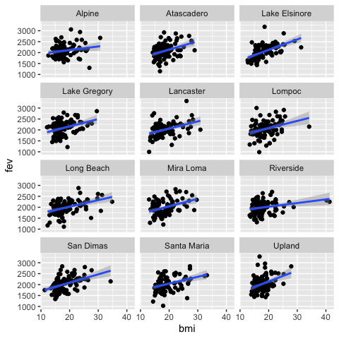
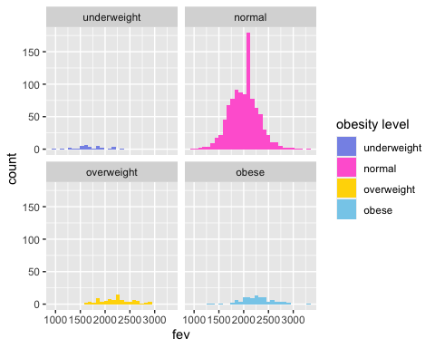
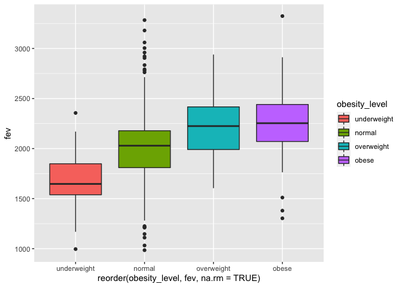

PM566_HW2
================
Yating Zeng
2022-10-07

# Description

For this assignment, data from USC’s Children’s Health Study would be
analyzed. The learning objectives are to conduct data wrangling and
visualize the data with key questions in mind.

# Step 1. Data Wrangling

The individual data includes personal and health characteristics of
children in 12 communities across Southern California. The regional data
include air quality measurements at the community level.

``` r
library(tidyverse)
```

    ## Warning: package 'tidyverse' was built under R version 4.1.2

    ## ── Attaching packages ─────────────────────────────────────── tidyverse 1.3.2 ──
    ## ✔ ggplot2 3.3.5     ✔ purrr   0.3.4
    ## ✔ tibble  3.1.6     ✔ dplyr   1.0.9
    ## ✔ tidyr   1.2.0     ✔ stringr 1.4.0
    ## ✔ readr   2.1.2     ✔ forcats 0.5.2

    ## Warning: package 'tidyr' was built under R version 4.1.2

    ## Warning: package 'readr' was built under R version 4.1.2

    ## Warning: package 'purrr' was built under R version 4.1.2

    ## Warning: package 'dplyr' was built under R version 4.1.2

    ## Warning: package 'forcats' was built under R version 4.1.2

    ## ── Conflicts ────────────────────────────────────────── tidyverse_conflicts() ──
    ## ✖ dplyr::filter() masks stats::filter()
    ## ✖ dplyr::lag()    masks stats::lag()

``` r
library(dplyr)
```

## Read in the data

``` r
if (!file.exists("chs_individual.csv")){
  download.file("https://raw.githubusercontent.com/USCbiostats/data-science-data/master/01_chs/chs_individual.csv", "chs_individual.csv", method="libcurl", timeout = 60)
}
if (!file.exists("chs_regional.csv")){
  download.file("https://raw.githubusercontent.com/USCbiostats/data-science-data/master/01_chs/chs_regional.csv", "chs_regional.csv", method="libcurl", timeout = 60)
}
chs_ind <- read.csv("chs_individual.csv")
chs_reg <- read.csv("chs_regional.csv")

str(chs_ind)
```

    ## 'data.frame':    1200 obs. of  23 variables:
    ##  $ sid          : int  1 2 6 7 8 10 13 16 19 21 ...
    ##  $ townname     : chr  "Lancaster" "Lancaster" "Lancaster" "Lancaster" ...
    ##  $ male         : int  1 1 0 0 0 1 1 0 0 0 ...
    ##  $ race         : chr  "W" "W" "B" "O" ...
    ##  $ hispanic     : int  0 0 0 0 1 1 1 0 0 1 ...
    ##  $ agepft       : num  10.15 10.46 10.1 10.75 9.78 ...
    ##  $ height       : int  123 145 145 156 132 NA 140 141 NA 126 ...
    ##  $ weight       : int  54 77 143 72 61 NA 79 74 NA 59 ...
    ##  $ bmi          : num  16.2 16.6 30.9 13.4 15.9 ...
    ##  $ asthma       : int  0 0 0 0 0 0 0 1 0 0 ...
    ##  $ active_asthma: int  0 0 0 0 0 1 0 0 0 0 ...
    ##  $ father_asthma: int  0 0 0 NA 1 1 0 0 0 0 ...
    ##  $ mother_asthma: int  0 0 0 0 0 0 0 1 0 0 ...
    ##  $ wheeze       : int  0 1 0 1 1 0 0 1 0 0 ...
    ##  $ hayfever     : int  0 0 1 0 1 0 0 0 0 0 ...
    ##  $ allergy      : int  0 0 0 0 1 0 0 1 0 1 ...
    ##  $ educ_parent  : int  3 5 2 2 3 1 3 3 3 3 ...
    ##  $ smoke        : int  0 0 0 1 0 0 0 1 0 0 ...
    ##  $ pets         : int  1 1 0 1 1 1 1 1 1 1 ...
    ##  $ gasstove     : int  1 0 1 1 0 1 0 1 1 1 ...
    ##  $ fev          : num  1650 2273 2012 1643 1652 ...
    ##  $ fvc          : num  1800 2721 2257 2061 1996 ...
    ##  $ mmef         : num  2538 2366 1819 1462 1607 ...

``` r
str(chs_reg)
```

    ## 'data.frame':    12 obs. of  27 variables:
    ##  $ townname   : chr  "Alpine" "Lake Elsinore" "Lake Gregory" "Lancaster" ...
    ##  $ pm25_mass  : num  8.74 12.35 7.66 8.5 5.96 ...
    ##  $ pm25_so4   : num  1.73 1.9 1.07 0.91 1.08 3.23 2.69 2.43 2.59 0.79 ...
    ##  $ pm25_no3   : num  1.59 2.98 2.07 1.87 0.73 6.22 12.2 8.66 7.2 1.38 ...
    ##  $ pm25_nh4   : num  0.88 1.36 0.91 0.78 0.41 2.57 4.25 3.14 2.71 0.61 ...
    ##  $ pm25_oc    : num  2.54 3.64 2.46 4.43 1.45 ...
    ##  $ pm25_ec    : num  0.48 0.62 0.4 0.55 0.13 1.36 1.25 0.94 1.17 0.4 ...
    ##  $ pm25_om    : num  3.04 4.36 2.96 5.32 1.74 6.25 14.2 6.32 6.71 3.97 ...
    ##  $ pm10_oc    : num  3.25 4.66 3.16 5.68 1.86 ...
    ##  $ pm10_ec    : num  0.49 0.63 0.41 0.56 0.14 1.39 1.28 0.96 1.19 0.41 ...
    ##  $ pm10_tc    : num  3.75 5.29 3.57 8.61 1.99 ...
    ##  $ formic     : num  1.03 1.18 0.66 0.88 0.34 1.57 1.9 1.72 2.77 0.74 ...
    ##  $ acetic     : num  2.49 3.56 2.36 2.88 0.75 2.94 5.14 3.92 4.24 2.11 ...
    ##  $ hcl        : num  0.41 0.46 0.28 0.22 0.33 0.73 0.46 0.47 0.55 0.31 ...
    ##  $ hno3       : num  1.98 2.63 2.28 1.8 0.43 2.67 3.33 3.43 4.07 0.97 ...
    ##  $ o3_max     : num  65.8 66.7 84.4 54.8 43.9 ...
    ##  $ o3106      : num  55 54.4 67 43.9 37.7 ...
    ##  $ o3_24      : num  41.2 32.2 57.8 32.9 28.4 ...
    ##  $ no2        : num  12.18 17.03 7.62 15.77 4.6 ...
    ##  $ pm10       : num  24.7 34.2 20.1 25 18.4 ...
    ##  $ no_24hr    : num  2.48 7.07 NA 12.68 2.05 ...
    ##  $ pm2_5_fr   : num  10.28 14.53 9.01 NA NA ...
    ##  $ iacid      : num  2.39 3.09 2.56 2.02 0.76 3.4 3.79 3.9 4.62 1.28 ...
    ##  $ oacid      : num  3.52 4.74 3.02 3.76 1.09 4.51 7.04 5.64 7.01 2.85 ...
    ##  $ total_acids: num  5.5 7.37 5.3 5.56 1.52 ...
    ##  $ lon        : num  -117 -117 -117 -118 -120 ...
    ##  $ lat        : num  32.8 33.7 34.2 34.7 34.6 ...

We could find that there are 1200 objects of 23 variables in individual
data and 12 objects of 27 variables in regional data. Thus, we’d better
check the data before merging the data.

``` r
unique(chs_ind$townname) %>%
  sort()
```

    ##  [1] "Alpine"        "Atascadero"    "Lake Elsinore" "Lake Gregory" 
    ##  [5] "Lancaster"     "Lompoc"        "Long Beach"    "Mira Loma"    
    ##  [9] "Riverside"     "San Dimas"     "Santa Maria"   "Upland"

``` r
unique(chs_reg$townname) %>%
  sort()
```

    ##  [1] "Alpine"        "Atascadero"    "Lake Elsinore" "Lake Gregory" 
    ##  [5] "Lancaster"     "Lompoc"        "Long Beach"    "Mira Loma"    
    ##  [9] "Riverside"     "San Dimas"     "Santa Maria"   "Upland"

The number of towns’ name are the same in these two datasets, thus, we
could use this variable to merge the data.

## Merge the data

``` r
chs <- 
  merge(
  # Data
  x     = chs_ind,      
  y     = chs_reg, 
  # List of variables to match
  by.x  = "townname",
  by.y  = "townname", 
  # Which obs to keep?
  all.x = TRUE,      
  all.y = FALSE
  )

nrow(chs)
```

    ## [1] 1200

After merging the data, we find that there are 1200 rows, which means
don’t have any duplicates by counting the number of rows. Make sure it
matches.

## check the missing values and impute the data

``` r
#checking the proportion of missing values
(colMeans(is.na(chs)))*100
```

    ##      townname           sid          male          race      hispanic 
    ##      0.000000      0.000000      0.000000      0.000000      0.000000 
    ##        agepft        height        weight           bmi        asthma 
    ##      7.416667      7.416667      7.416667      7.416667      2.583333 
    ## active_asthma father_asthma mother_asthma        wheeze      hayfever 
    ##      0.000000      8.833333      4.666667      5.916667      9.833333 
    ##       allergy   educ_parent         smoke          pets      gasstove 
    ##      5.250000      5.333333      3.333333      0.000000      2.750000 
    ##           fev           fvc          mmef     pm25_mass      pm25_so4 
    ##      7.916667      8.083333      8.833333      0.000000      0.000000 
    ##      pm25_no3      pm25_nh4       pm25_oc       pm25_ec       pm25_om 
    ##      0.000000      0.000000      0.000000      0.000000      0.000000 
    ##       pm10_oc       pm10_ec       pm10_tc        formic        acetic 
    ##      0.000000      0.000000      0.000000      0.000000      0.000000 
    ##           hcl          hno3        o3_max         o3106         o3_24 
    ##      0.000000      0.000000      0.000000      0.000000      0.000000 
    ##           no2          pm10       no_24hr      pm2_5_fr         iacid 
    ##      0.000000      0.000000      8.333333     25.000000      0.000000 
    ##         oacid   total_acids           lon           lat 
    ##      0.000000      0.000000      0.000000      0.000000

There are still some missing values. In the case of missing values, we
imputed data using the average within the variables “male” and
“hispanic.”

``` r
#build up a subset for calculating each column's mean
mean0 <- chs[which(chs$male==1 & chs$hispanic==1), ]
#calculate the mean of the subset used to impute the data
mean1 <- sapply(mean0, mean, na.rm = T) 
```

    ## Warning in mean.default(X[[i]], ...): argument is not numeric or logical:
    ## returning NA

    ## Warning in mean.default(X[[i]], ...): argument is not numeric or logical:
    ## returning NA

``` r
chs0 <- chs # Duplicate data frame
for(i in 1:ncol(chs)) {  # Replace NA in all columns
  chs0[ , i][is.na(chs0[ , i])] <- mean1[i]
}
#check the data after imputing
(colMeans(is.na(chs0)))*100
```

    ##      townname           sid          male          race      hispanic 
    ##             0             0             0             0             0 
    ##        agepft        height        weight           bmi        asthma 
    ##             0             0             0             0             0 
    ## active_asthma father_asthma mother_asthma        wheeze      hayfever 
    ##             0             0             0             0             0 
    ##       allergy   educ_parent         smoke          pets      gasstove 
    ##             0             0             0             0             0 
    ##           fev           fvc          mmef     pm25_mass      pm25_so4 
    ##             0             0             0             0             0 
    ##      pm25_no3      pm25_nh4       pm25_oc       pm25_ec       pm25_om 
    ##             0             0             0             0             0 
    ##       pm10_oc       pm10_ec       pm10_tc        formic        acetic 
    ##             0             0             0             0             0 
    ##           hcl          hno3        o3_max         o3106         o3_24 
    ##             0             0             0             0             0 
    ##           no2          pm10       no_24hr      pm2_5_fr         iacid 
    ##             0             0             0             0             0 
    ##         oacid   total_acids           lon           lat 
    ##             0             0             0             0

``` r
head(chs0)
```

    ##   townname sid male race hispanic    agepft height weight      bmi asthma
    ## 1   Alpine 841    1    W        1 10.548939    150     78 15.75758      0
    ## 2   Alpine 835    0    W        0 10.099932    143     69 15.33749      0
    ## 3   Alpine 838    0    O        1  9.486653    133     62 15.93183      0
    ## 4   Alpine 840    0    W        0  9.965777    146     78 16.63283      0
    ## 5   Alpine 865    0    W        0 10.039699    162    140 24.24797      1
    ## 6   Alpine 867    0    W        1  9.957563    141     94 21.49151      0
    ##   active_asthma father_asthma mother_asthma wheeze hayfever allergy educ_parent
    ## 1             0    0.00000000             0      0        0       0    5.000000
    ## 2             0    0.00000000             0      0        0       1    3.000000
    ## 3             0    0.00000000             0      0        0       0    4.000000
    ## 4             0    0.00000000             0      0        0       0    2.423868
    ## 5             1    0.00000000             0      1        0       1    3.000000
    ## 6             0    0.08403361             0      0        0       0    5.000000
    ##       smoke pets  gasstove      fev      fvc     mmef pm25_mass pm25_so4
    ## 1 0.0000000    1 0.0000000 2251.505 2594.649 2445.151      8.74     1.73
    ## 2 0.0000000    1 0.0000000 2529.276 2826.316 3406.579      8.74     1.73
    ## 3 0.1501976    1 0.0000000 1737.793 1963.545 2133.110      8.74     1.73
    ## 4 0.1501976    0 0.8156863 2466.791 2638.221 3466.464      8.74     1.73
    ## 5 0.0000000    1 1.0000000 2583.934 3567.541 2071.475      8.74     1.73
    ## 6 0.0000000    1 1.0000000 1973.115 2154.098 2690.164      8.74     1.73
    ##   pm25_no3 pm25_nh4 pm25_oc pm25_ec pm25_om pm10_oc pm10_ec pm10_tc formic
    ## 1     1.59     0.88    2.54    0.48    3.04    3.25    0.49    3.75   1.03
    ## 2     1.59     0.88    2.54    0.48    3.04    3.25    0.49    3.75   1.03
    ## 3     1.59     0.88    2.54    0.48    3.04    3.25    0.49    3.75   1.03
    ## 4     1.59     0.88    2.54    0.48    3.04    3.25    0.49    3.75   1.03
    ## 5     1.59     0.88    2.54    0.48    3.04    3.25    0.49    3.75   1.03
    ## 6     1.59     0.88    2.54    0.48    3.04    3.25    0.49    3.75   1.03
    ##   acetic  hcl hno3 o3_max o3106 o3_24   no2  pm10 no_24hr pm2_5_fr iacid oacid
    ## 1   2.49 0.41 1.98  65.82 55.05 41.23 12.18 24.73    2.48    10.28  2.39  3.52
    ## 2   2.49 0.41 1.98  65.82 55.05 41.23 12.18 24.73    2.48    10.28  2.39  3.52
    ## 3   2.49 0.41 1.98  65.82 55.05 41.23 12.18 24.73    2.48    10.28  2.39  3.52
    ## 4   2.49 0.41 1.98  65.82 55.05 41.23 12.18 24.73    2.48    10.28  2.39  3.52
    ## 5   2.49 0.41 1.98  65.82 55.05 41.23 12.18 24.73    2.48    10.28  2.39  3.52
    ## 6   2.49 0.41 1.98  65.82 55.05 41.23 12.18 24.73    2.48    10.28  2.39  3.52
    ##   total_acids       lon      lat
    ## 1         5.5 -116.7664 32.83505
    ## 2         5.5 -116.7664 32.83505
    ## 3         5.5 -116.7664 32.83505
    ## 4         5.5 -116.7664 32.83505
    ## 5         5.5 -116.7664 32.83505
    ## 6         5.5 -116.7664 32.83505

After checking all the variable, we could find the proportions of
missing value for each column are all zero. But what needs to be noticed
is that even though it was acceptable to replace the missing values with
the “mean” of a subset for the numeric variable, but it was unreasonable
for some categorical variable to do so, like “smoke” and “gas”. Thus
We’d better still analyze without these missing data for further
questions, when we are about to analyze about the relationships between
these categorical variables and others. But for now, the data was
acceptable.

## Create a new categorical variable “obesity_level”

``` r
chs1 <- chs0 %>%
  mutate(obesity_level = case_when(bmi <  14 ~ "underweight",
                                   bmi <= 22 ~ "normal",
                                   bmi <= 24 ~ "overweight",
                                   bmi >  24 ~ "obese" ))
head(chs1)
```

    ##   townname sid male race hispanic    agepft height weight      bmi asthma
    ## 1   Alpine 841    1    W        1 10.548939    150     78 15.75758      0
    ## 2   Alpine 835    0    W        0 10.099932    143     69 15.33749      0
    ## 3   Alpine 838    0    O        1  9.486653    133     62 15.93183      0
    ## 4   Alpine 840    0    W        0  9.965777    146     78 16.63283      0
    ## 5   Alpine 865    0    W        0 10.039699    162    140 24.24797      1
    ## 6   Alpine 867    0    W        1  9.957563    141     94 21.49151      0
    ##   active_asthma father_asthma mother_asthma wheeze hayfever allergy educ_parent
    ## 1             0    0.00000000             0      0        0       0    5.000000
    ## 2             0    0.00000000             0      0        0       1    3.000000
    ## 3             0    0.00000000             0      0        0       0    4.000000
    ## 4             0    0.00000000             0      0        0       0    2.423868
    ## 5             1    0.00000000             0      1        0       1    3.000000
    ## 6             0    0.08403361             0      0        0       0    5.000000
    ##       smoke pets  gasstove      fev      fvc     mmef pm25_mass pm25_so4
    ## 1 0.0000000    1 0.0000000 2251.505 2594.649 2445.151      8.74     1.73
    ## 2 0.0000000    1 0.0000000 2529.276 2826.316 3406.579      8.74     1.73
    ## 3 0.1501976    1 0.0000000 1737.793 1963.545 2133.110      8.74     1.73
    ## 4 0.1501976    0 0.8156863 2466.791 2638.221 3466.464      8.74     1.73
    ## 5 0.0000000    1 1.0000000 2583.934 3567.541 2071.475      8.74     1.73
    ## 6 0.0000000    1 1.0000000 1973.115 2154.098 2690.164      8.74     1.73
    ##   pm25_no3 pm25_nh4 pm25_oc pm25_ec pm25_om pm10_oc pm10_ec pm10_tc formic
    ## 1     1.59     0.88    2.54    0.48    3.04    3.25    0.49    3.75   1.03
    ## 2     1.59     0.88    2.54    0.48    3.04    3.25    0.49    3.75   1.03
    ## 3     1.59     0.88    2.54    0.48    3.04    3.25    0.49    3.75   1.03
    ## 4     1.59     0.88    2.54    0.48    3.04    3.25    0.49    3.75   1.03
    ## 5     1.59     0.88    2.54    0.48    3.04    3.25    0.49    3.75   1.03
    ## 6     1.59     0.88    2.54    0.48    3.04    3.25    0.49    3.75   1.03
    ##   acetic  hcl hno3 o3_max o3106 o3_24   no2  pm10 no_24hr pm2_5_fr iacid oacid
    ## 1   2.49 0.41 1.98  65.82 55.05 41.23 12.18 24.73    2.48    10.28  2.39  3.52
    ## 2   2.49 0.41 1.98  65.82 55.05 41.23 12.18 24.73    2.48    10.28  2.39  3.52
    ## 3   2.49 0.41 1.98  65.82 55.05 41.23 12.18 24.73    2.48    10.28  2.39  3.52
    ## 4   2.49 0.41 1.98  65.82 55.05 41.23 12.18 24.73    2.48    10.28  2.39  3.52
    ## 5   2.49 0.41 1.98  65.82 55.05 41.23 12.18 24.73    2.48    10.28  2.39  3.52
    ## 6   2.49 0.41 1.98  65.82 55.05 41.23 12.18 24.73    2.48    10.28  2.39  3.52
    ##   total_acids       lon      lat obesity_level
    ## 1         5.5 -116.7664 32.83505        normal
    ## 2         5.5 -116.7664 32.83505        normal
    ## 3         5.5 -116.7664 32.83505        normal
    ## 4         5.5 -116.7664 32.83505        normal
    ## 5         5.5 -116.7664 32.83505         obese
    ## 6         5.5 -116.7664 32.83505        normal

## create a summary table that contains the minimum BMI, maximum BMI, and the total number of observations per category

``` r
chs1 %>% group_by(obesity_level) %>%
    summarise(
      bmi_minimun   = min(bmi, na.rm=TRUE),
      bmi_maximun   = max(bmi, na.rm=TRUE),
      total_num     = n()
    ) %>% arrange(obesity_level)
```

    ## # A tibble: 4 × 4
    ##   obesity_level bmi_minimun bmi_maximun total_num
    ##   <chr>               <dbl>       <dbl>     <int>
    ## 1 normal               14.0        22.0       975
    ## 2 obese                24.0        41.3       103
    ## 3 overweight           22.0        24.0        87
    ## 4 underweight          11.3        14.0        35

We could see that all the minimum and maximum are follow the criteria
used to categorize, and the sum of the number of each subgroups is still
1200, verifing correct classification.

## Create a new categorical variable “smoke_gas_exposure”

Create another categorical variable named “smoke_gas_exposure” that
summarizes “Second Hand Smoke” and “Gas Stove.”

``` r
chs2 <- chs1 %>%
  mutate(smoke_gas_exposure 
         = case_when(gasstove == 1&smoke == 1 ~ "exposed to both gas and smoke",
                     gasstove == 0&smoke == 1 ~ "exposed to only smoke",
                     gasstove == 1&smoke == 0 ~ "exposed to only gas",
                     gasstove == 0&smoke == 0 ~ "unexposed to both gas and smoke" ))
unique(chs2$smoke_gas_exposure)
```

    ## [1] "unexposed to both gas and smoke" NA                               
    ## [3] "exposed to only gas"             "exposed to only smoke"          
    ## [5] "exposed to both gas and smoke"

There are 5 types of results in this variable, including “NA”,
“unexposed to both gas and smoke”, “exposed to only gas”, “exposed to
only smoke” and “exposed to both gas and smoke”. Thus the variable does
just have four categories in total.

## Create four summary tables

Create four summary tables showing the average (or proportion, if
binary) and sd of “Forced expiratory volume in 1 second (ml)” and asthma
indicator by town, sex, obesity level, and “smoke_gas_exposure.”

``` r
#for (i in c("townname","male","obesity_level","smoke_gas_exposure" )){
chs2 %>% group_by(townname) %>%
    summarise(
      N           = length(townname),
      fev_mean    = mean(fev, na.rm=TRUE),
      fev_sd      = sd(fev, na.rm=TRUE),
      asthma_yes  = 100*sum(asthma==1,na.rm=TRUE)/sum(asthma %in% c(1, 0),na.rm=TRUE),
    ) %>% arrange(fev_mean)
```

    ## # A tibble: 12 × 5
    ##    townname          N fev_mean fev_sd asthma_yes
    ##    <chr>         <int>    <dbl>  <dbl>      <dbl>
    ##  1 Long Beach      100    1993.   321.       13.5
    ##  2 Mira Loma       100    1994.   326.       15.8
    ##  3 Riverside       100    1998.   279.       11  
    ##  4 Lancaster       100    2017.   318.       16.5
    ##  5 San Dimas       100    2030.   319.       17.2
    ##  6 Santa Maria     100    2033.   313.       13.4
    ##  7 Upland          100    2035.   343.       12.1
    ##  8 Lompoc          100    2046.   351.       11.3
    ##  9 Lake Elsinore   100    2047.   304.       12.6
    ## 10 Atascadero      100    2081.   324.       25.5
    ## 11 Alpine          100    2091.   291.       11.3
    ## 12 Lake Gregory    100    2095.   319.       15.2

Based on the results shown above, it’s hard to find a relationship among
town, fev and asthma.

``` r
chs2 %>% group_by(male) %>%
    summarise(
      N           = length(townname),
      fev_mean    = mean(fev, na.rm=TRUE),
      fev_sd      = sd(fev, na.rm=TRUE),
      asthma_yes  = 100*sum(asthma==1,na.rm=TRUE)/sum(asthma %in% c(1, 0),na.rm=TRUE),
    ) %>% arrange(male)
```

    ## # A tibble: 2 × 5
    ##    male     N fev_mean fev_sd asthma_yes
    ##   <dbl> <int>    <dbl>  <dbl>      <dbl>
    ## 1     0   610    1974.   315.       12.1
    ## 2     1   590    2105.   308.       17.3

Based on the results above, we could notice that mean fev and the
proportion of asthma are both larger among males than females. But the
relationship still need further study to verify.

``` r
chs2 %>% group_by(obesity_level) %>%
    summarise(
      N           = length(townname),
      fev_mean    = mean(fev, na.rm=TRUE),
      fev_sd      = sd(fev, na.rm=TRUE),
      asthma_yes  = 100*sum(asthma==1,na.rm=TRUE)/sum(asthma %in% c(1, 0),na.rm=TRUE),
    ) %>% arrange(fev_mean)
```

    ## # A tibble: 4 × 5
    ##   obesity_level     N fev_mean fev_sd asthma_yes
    ##   <chr>         <int>    <dbl>  <dbl>      <dbl>
    ## 1 underweight      35    1699.   305.       8.57
    ## 2 normal          975    2010.   296.      14.0 
    ## 3 overweight       87    2224.   317.      16.5 
    ## 4 obese           103    2268.   324.      21

Based on the results above, we could notice that mean fev and the
proportion of asthma both become larger with the obesity level
increasing. But the relationship still need further study to verify.

``` r
chs2[which(!is.na(chs2$smoke_gas_exposure)), ] %>%
    group_by(smoke_gas_exposure) %>%
    summarise(
      N           = length(townname),
      fev_mean    = mean(fev, na.rm=TRUE),
      fev_sd      = sd(fev, na.rm=TRUE),
      asthma_yes  = 100*sum(asthma==1,na.rm=TRUE)/sum(asthma %in% c(1, 0),na.rm=TRUE),
    ) %>% arrange(fev_mean)
```

    ## # A tibble: 4 × 5
    ##   smoke_gas_exposure                  N fev_mean fev_sd asthma_yes
    ##   <chr>                           <int>    <dbl>  <dbl>      <dbl>
    ## 1 exposed to both gas and smoke     151    2029.   300.       13.0
    ## 2 exposed to only gas               739    2033.   318.       14.8
    ## 3 unexposed to both gas and smoke   214    2064.   330.       14.8
    ## 4 exposed to only smoke              36    2077.   294.       17.1

Based on the results above, we could notice that mean fev and the
proportion of asthma both are the minimum in the group with exposed to
both gas and smoke, and the maximum in the group exposed to only smoke.
But the relationship still need further study to verify.

# Exploratory Data Analysis

## Formulate the questions

The primary questions of interest are: 1. What is the association
between BMI and FEV (forced expiratory volume)? 2. What is the
association between smoke and gas exposure and FEV? 3. What is the
association between PM2.5 exposure and FEV?

## Check the dimensions and headers and footers of the data

``` r
dim(chs2)
```

    ## [1] 1200   51

``` r
str(chs2)
```

    ## 'data.frame':    1200 obs. of  51 variables:
    ##  $ townname          : chr  "Alpine" "Alpine" "Alpine" "Alpine" ...
    ##  $ sid               : num  841 835 838 840 865 867 842 839 844 847 ...
    ##  $ male              : num  1 0 0 0 0 0 1 0 1 1 ...
    ##  $ race              : chr  "W" "W" "O" "W" ...
    ##  $ hispanic          : num  1 0 1 0 0 1 1 1 1 0 ...
    ##  $ agepft            : num  10.55 10.1 9.49 9.97 10.04 ...
    ##  $ height            : num  150 143 133 146 162 141 139 142 143 137 ...
    ##  $ weight            : num  78 69 62 78 140 94 65 86 65 69 ...
    ##  $ bmi               : num  15.8 15.3 15.9 16.6 24.2 ...
    ##  $ asthma            : num  0 0 0 0 1 ...
    ##  $ active_asthma     : num  0 0 0 0 1 0 0 0 0 0 ...
    ##  $ father_asthma     : num  0 0 0 0 0 ...
    ##  $ mother_asthma     : num  0 0 0 0 0 ...
    ##  $ wheeze            : num  0 0 0 0 1 ...
    ##  $ hayfever          : num  0 0 0 0 0 ...
    ##  $ allergy           : num  0 1 0 0 1 ...
    ##  $ educ_parent       : num  5 3 4 2.42 3 ...
    ##  $ smoke             : num  0 0 0.15 0.15 0 ...
    ##  $ pets              : num  1 1 1 0 1 1 1 1 0 1 ...
    ##  $ gasstove          : num  0 0 0 0.816 1 ...
    ##  $ fev               : num  2252 2529 1738 2467 2584 ...
    ##  $ fvc               : num  2595 2826 1964 2638 3568 ...
    ##  $ mmef              : num  2445 3407 2133 3466 2071 ...
    ##  $ pm25_mass         : num  8.74 8.74 8.74 8.74 8.74 8.74 8.74 8.74 8.74 8.74 ...
    ##  $ pm25_so4          : num  1.73 1.73 1.73 1.73 1.73 1.73 1.73 1.73 1.73 1.73 ...
    ##  $ pm25_no3          : num  1.59 1.59 1.59 1.59 1.59 1.59 1.59 1.59 1.59 1.59 ...
    ##  $ pm25_nh4          : num  0.88 0.88 0.88 0.88 0.88 0.88 0.88 0.88 0.88 0.88 ...
    ##  $ pm25_oc           : num  2.54 2.54 2.54 2.54 2.54 2.54 2.54 2.54 2.54 2.54 ...
    ##  $ pm25_ec           : num  0.48 0.48 0.48 0.48 0.48 0.48 0.48 0.48 0.48 0.48 ...
    ##  $ pm25_om           : num  3.04 3.04 3.04 3.04 3.04 3.04 3.04 3.04 3.04 3.04 ...
    ##  $ pm10_oc           : num  3.25 3.25 3.25 3.25 3.25 3.25 3.25 3.25 3.25 3.25 ...
    ##  $ pm10_ec           : num  0.49 0.49 0.49 0.49 0.49 0.49 0.49 0.49 0.49 0.49 ...
    ##  $ pm10_tc           : num  3.75 3.75 3.75 3.75 3.75 3.75 3.75 3.75 3.75 3.75 ...
    ##  $ formic            : num  1.03 1.03 1.03 1.03 1.03 1.03 1.03 1.03 1.03 1.03 ...
    ##  $ acetic            : num  2.49 2.49 2.49 2.49 2.49 2.49 2.49 2.49 2.49 2.49 ...
    ##  $ hcl               : num  0.41 0.41 0.41 0.41 0.41 0.41 0.41 0.41 0.41 0.41 ...
    ##  $ hno3              : num  1.98 1.98 1.98 1.98 1.98 1.98 1.98 1.98 1.98 1.98 ...
    ##  $ o3_max            : num  65.8 65.8 65.8 65.8 65.8 ...
    ##  $ o3106             : num  55 55 55 55 55 ...
    ##  $ o3_24             : num  41.2 41.2 41.2 41.2 41.2 ...
    ##  $ no2               : num  12.2 12.2 12.2 12.2 12.2 ...
    ##  $ pm10              : num  24.7 24.7 24.7 24.7 24.7 ...
    ##  $ no_24hr           : num  2.48 2.48 2.48 2.48 2.48 2.48 2.48 2.48 2.48 2.48 ...
    ##  $ pm2_5_fr          : num  10.3 10.3 10.3 10.3 10.3 ...
    ##  $ iacid             : num  2.39 2.39 2.39 2.39 2.39 2.39 2.39 2.39 2.39 2.39 ...
    ##  $ oacid             : num  3.52 3.52 3.52 3.52 3.52 3.52 3.52 3.52 3.52 3.52 ...
    ##  $ total_acids       : num  5.5 5.5 5.5 5.5 5.5 5.5 5.5 5.5 5.5 5.5 ...
    ##  $ lon               : num  -117 -117 -117 -117 -117 ...
    ##  $ lat               : num  32.8 32.8 32.8 32.8 32.8 ...
    ##  $ obesity_level     : chr  "normal" "normal" "normal" "normal" ...
    ##  $ smoke_gas_exposure: chr  "unexposed to both gas and smoke" "unexposed to both gas and smoke" NA NA ...

``` r
head(chs2)
```

    ##   townname sid male race hispanic    agepft height weight      bmi asthma
    ## 1   Alpine 841    1    W        1 10.548939    150     78 15.75758      0
    ## 2   Alpine 835    0    W        0 10.099932    143     69 15.33749      0
    ## 3   Alpine 838    0    O        1  9.486653    133     62 15.93183      0
    ## 4   Alpine 840    0    W        0  9.965777    146     78 16.63283      0
    ## 5   Alpine 865    0    W        0 10.039699    162    140 24.24797      1
    ## 6   Alpine 867    0    W        1  9.957563    141     94 21.49151      0
    ##   active_asthma father_asthma mother_asthma wheeze hayfever allergy educ_parent
    ## 1             0    0.00000000             0      0        0       0    5.000000
    ## 2             0    0.00000000             0      0        0       1    3.000000
    ## 3             0    0.00000000             0      0        0       0    4.000000
    ## 4             0    0.00000000             0      0        0       0    2.423868
    ## 5             1    0.00000000             0      1        0       1    3.000000
    ## 6             0    0.08403361             0      0        0       0    5.000000
    ##       smoke pets  gasstove      fev      fvc     mmef pm25_mass pm25_so4
    ## 1 0.0000000    1 0.0000000 2251.505 2594.649 2445.151      8.74     1.73
    ## 2 0.0000000    1 0.0000000 2529.276 2826.316 3406.579      8.74     1.73
    ## 3 0.1501976    1 0.0000000 1737.793 1963.545 2133.110      8.74     1.73
    ## 4 0.1501976    0 0.8156863 2466.791 2638.221 3466.464      8.74     1.73
    ## 5 0.0000000    1 1.0000000 2583.934 3567.541 2071.475      8.74     1.73
    ## 6 0.0000000    1 1.0000000 1973.115 2154.098 2690.164      8.74     1.73
    ##   pm25_no3 pm25_nh4 pm25_oc pm25_ec pm25_om pm10_oc pm10_ec pm10_tc formic
    ## 1     1.59     0.88    2.54    0.48    3.04    3.25    0.49    3.75   1.03
    ## 2     1.59     0.88    2.54    0.48    3.04    3.25    0.49    3.75   1.03
    ## 3     1.59     0.88    2.54    0.48    3.04    3.25    0.49    3.75   1.03
    ## 4     1.59     0.88    2.54    0.48    3.04    3.25    0.49    3.75   1.03
    ## 5     1.59     0.88    2.54    0.48    3.04    3.25    0.49    3.75   1.03
    ## 6     1.59     0.88    2.54    0.48    3.04    3.25    0.49    3.75   1.03
    ##   acetic  hcl hno3 o3_max o3106 o3_24   no2  pm10 no_24hr pm2_5_fr iacid oacid
    ## 1   2.49 0.41 1.98  65.82 55.05 41.23 12.18 24.73    2.48    10.28  2.39  3.52
    ## 2   2.49 0.41 1.98  65.82 55.05 41.23 12.18 24.73    2.48    10.28  2.39  3.52
    ## 3   2.49 0.41 1.98  65.82 55.05 41.23 12.18 24.73    2.48    10.28  2.39  3.52
    ## 4   2.49 0.41 1.98  65.82 55.05 41.23 12.18 24.73    2.48    10.28  2.39  3.52
    ## 5   2.49 0.41 1.98  65.82 55.05 41.23 12.18 24.73    2.48    10.28  2.39  3.52
    ## 6   2.49 0.41 1.98  65.82 55.05 41.23 12.18 24.73    2.48    10.28  2.39  3.52
    ##   total_acids       lon      lat obesity_level              smoke_gas_exposure
    ## 1         5.5 -116.7664 32.83505        normal unexposed to both gas and smoke
    ## 2         5.5 -116.7664 32.83505        normal unexposed to both gas and smoke
    ## 3         5.5 -116.7664 32.83505        normal                            <NA>
    ## 4         5.5 -116.7664 32.83505        normal                            <NA>
    ## 5         5.5 -116.7664 32.83505         obese             exposed to only gas
    ## 6         5.5 -116.7664 32.83505        normal             exposed to only gas

``` r
tail(chs2)
```

    ##      townname  sid male race hispanic    agepft   height   weight      bmi
    ## 1195   Upland 1866    0    O        1  9.806982 139.0000 60.00000 14.11559
    ## 1196   Upland 1867    0    M        1  9.618070 140.0000 71.00000 16.46568
    ## 1197   Upland 2033    0    M        0 10.121834 130.0000 67.00000 18.02044
    ## 1198   Upland 2031    1    W        0  9.798768 135.0000 83.00000 20.70084
    ## 1199   Upland 2032    1    W        0  9.549624 137.0000 59.00000 14.28855
    ## 1200   Upland 2053    0    W        0  9.966942 138.5984 82.76707 19.41148
    ##      asthma active_asthma father_asthma mother_asthma wheeze  hayfever
    ## 1195      0             0    0.08403361             0      0 0.1744681
    ## 1196      0             0    1.00000000             0      0 0.0000000
    ## 1197      0             1    0.00000000             0      1 1.0000000
    ## 1198      0             0    0.00000000             0      1 0.0000000
    ## 1199      0             0    0.00000000             1      1 1.0000000
    ## 1200      0             0    0.00000000             0      0 0.0000000
    ##        allergy educ_parent smoke pets gasstove      fev      fvc     mmef
    ## 1195 0.2540323           3     0    1        0 1691.275 1928.859 1890.604
    ## 1196 0.0000000           3     0    1        0 1733.338 1993.040 2072.643
    ## 1197 0.0000000           3     0    1        1 1929.866 2122.148 2558.054
    ## 1198 1.0000000           3     0    1        1 2034.177 2505.535 1814.075
    ## 1199 1.0000000           3     0    1        1 2077.703 2275.338 2706.081
    ## 1200 0.0000000           3     0    1        0 2120.266 2443.876 2447.494
    ##      pm25_mass pm25_so4 pm25_no3 pm25_nh4 pm25_oc pm25_ec pm25_om pm10_oc
    ## 1195     22.46     2.65     7.75     2.96    6.49    1.19    7.79    8.32
    ## 1196     22.46     2.65     7.75     2.96    6.49    1.19    7.79    8.32
    ## 1197     22.46     2.65     7.75     2.96    6.49    1.19    7.79    8.32
    ## 1198     22.46     2.65     7.75     2.96    6.49    1.19    7.79    8.32
    ## 1199     22.46     2.65     7.75     2.96    6.49    1.19    7.79    8.32
    ## 1200     22.46     2.65     7.75     2.96    6.49    1.19    7.79    8.32
    ##      pm10_ec pm10_tc formic acetic  hcl hno3 o3_max o3106 o3_24   no2 pm10
    ## 1195    1.22    9.54   2.67   4.73 0.46 4.03  63.83  46.5  22.2 37.97 40.8
    ## 1196    1.22    9.54   2.67   4.73 0.46 4.03  63.83  46.5  22.2 37.97 40.8
    ## 1197    1.22    9.54   2.67   4.73 0.46 4.03  63.83  46.5  22.2 37.97 40.8
    ## 1198    1.22    9.54   2.67   4.73 0.46 4.03  63.83  46.5  22.2 37.97 40.8
    ## 1199    1.22    9.54   2.67   4.73 0.46 4.03  63.83  46.5  22.2 37.97 40.8
    ## 1200    1.22    9.54   2.67   4.73 0.46 4.03  63.83  46.5  22.2 37.97 40.8
    ##      no_24hr pm2_5_fr iacid oacid total_acids       lon      lat obesity_level
    ## 1195   18.48    27.73  4.49   7.4       11.43 -117.6484 34.09751        normal
    ## 1196   18.48    27.73  4.49   7.4       11.43 -117.6484 34.09751        normal
    ## 1197   18.48    27.73  4.49   7.4       11.43 -117.6484 34.09751        normal
    ## 1198   18.48    27.73  4.49   7.4       11.43 -117.6484 34.09751        normal
    ## 1199   18.48    27.73  4.49   7.4       11.43 -117.6484 34.09751        normal
    ## 1200   18.48    27.73  4.49   7.4       11.43 -117.6484 34.09751        normal
    ##                   smoke_gas_exposure
    ## 1195 unexposed to both gas and smoke
    ## 1196 unexposed to both gas and smoke
    ## 1197             exposed to only gas
    ## 1198             exposed to only gas
    ## 1199             exposed to only gas
    ## 1200 unexposed to both gas and smoke

``` r
(colMeans(is.na(chs2)))*100
```

    ##           townname                sid               male               race 
    ##                  0                  0                  0                  0 
    ##           hispanic             agepft             height             weight 
    ##                  0                  0                  0                  0 
    ##                bmi             asthma      active_asthma      father_asthma 
    ##                  0                  0                  0                  0 
    ##      mother_asthma             wheeze           hayfever            allergy 
    ##                  0                  0                  0                  0 
    ##        educ_parent              smoke               pets           gasstove 
    ##                  0                  0                  0                  0 
    ##                fev                fvc               mmef          pm25_mass 
    ##                  0                  0                  0                  0 
    ##           pm25_so4           pm25_no3           pm25_nh4            pm25_oc 
    ##                  0                  0                  0                  0 
    ##            pm25_ec            pm25_om            pm10_oc            pm10_ec 
    ##                  0                  0                  0                  0 
    ##            pm10_tc             formic             acetic                hcl 
    ##                  0                  0                  0                  0 
    ##               hno3             o3_max              o3106              o3_24 
    ##                  0                  0                  0                  0 
    ##                no2               pm10            no_24hr           pm2_5_fr 
    ##                  0                  0                  0                  0 
    ##              iacid              oacid        total_acids                lon 
    ##                  0                  0                  0                  0 
    ##                lat      obesity_level smoke_gas_exposure 
    ##                  0                  0                  5

This data consists of 1200 objects of 51 variables, including BMI,
obesity level, FEV, smoke and gas exposure and PM2.5, which are of our
research interest. Towards these variables mentioned above, we have
already replaced the missing value of the continuous variables (i.e bmi,
fev and PM2.5), and there is only the new variable having missing value,
which is “smoke and gas exposure”, with proportion was 5%, and we would
not use this passing value for the study bellow.

## Facet plot showing scatterplots with regression lines of BMI vs FEV by “townname”

``` r
library(ggplot2)
ggplot(data = chs2, aes(x = bmi, y = fev)) + 
  geom_point(mapping = aes(x = bmi, y = fev)) + 
  facet_wrap(~ townname, nrow = 4) +
  geom_smooth(stat = "smooth", method = "lm")
```

    ## `geom_smooth()` using formula 'y ~ x'

<!-- -->

These plots show a relationship between BMI and Fev, to be more
specific, the fev seems to be larger with the increase of BMI.

## Stacked histograms of FEV by BMI category and FEV by smoke/gas exposure. Use different color schemes than the ggplot default.

``` r
#Stacked histograms of FEV by BMI category

library(ggplot2)
ggplot(data = chs2, aes(x = fev, fill = obesity_level)) + 
  geom_histogram(position = "stack") +
  scale_fill_manual(name="Obesity level", 
                    values = c("#8795E8", "#FF6AD5","gold","skyblue"))
```

    ## `stat_bin()` using `bins = 30`. Pick better value with `binwidth`.

<!-- -->

``` r
#Stacked histograms of FEV by smoke/gas exposure

library(ggplot2)
chs2 %>%
  filter(!is.na(smoke_gas_exposure)) %>%
ggplot(aes(x = fev,fill = smoke_gas_exposure,)) + 
  geom_histogram(position = "stack") +
  scale_fill_manual(name = "smoke or gas exposure", 
                    values = c("#8795E8", "#FF6AD5","gold","skyblue"))
```

    ## `stat_bin()` using `bins = 30`. Pick better value with `binwidth`.

<!-- -->

After observing the histograms above, we could find a difference of the
distribution among the groups of obesity level and smoke and gas level.
Among the groups of different obesity level, their distributions all
look normal, but with different means, which is smaller with the obesity
level decreasing. Among the groups of different smoke and gas level,
it’s hard to diagnose a difference among the distribution, especially
their means of Fev.

## Barchart of BMI by smoke/gas exposure.

``` r
# All raw bmi were used to create the barchart
chs2 %>%
  filter(!is.na(smoke_gas_exposure)) %>%
  ggplot(aes(x=smoke_gas_exposure, y=bmi)) + 
  geom_bar(stat = "identity") +
  coord_flip()
```

<!-- -->

It would be hard to find the possible relationship between bmi and smoke
and gas exposure, because the number of each group would affect the sum
of BMI, so we would calculate the mean of bmi to represent for the bmi
level of each groups of smoke and gas exposure.

``` r
# Mean of bmi were used to create the barchart
mean_bmi <- chs2 %>%
  filter(!is.na(smoke_gas_exposure)) %>%
  group_by(smoke_gas_exposure) %>%
  mutate(mean_bmi = mean(bmi, na.rm = TRUE)) %>%
  ungroup() %>%
  select(smoke_gas_exposure, mean_bmi) %>%
  distinct()

chs2 %>%
  filter(!is.na(smoke_gas_exposure)) %>%
  ggplot(aes(x=smoke_gas_exposure, y=bmi)) + 
  geom_bar(data=mean_bmi, 
           aes(x=smoke_gas_exposure,y=mean_bmi),
           stat = "identity") +
  coord_flip()
```

<!-- -->

There is little difference among the means of all smoke and gas groups
by checking the barchart.

## Statistical summary graphs of FEV by BMI and FEV by smoke/gas exposure category

``` r
#summary graphs of FEV by BMI
ggplot(data = chs2) + 
  geom_point(mapping = aes(x = bmi, y = fev)) +
  geom_smooth(mapping = aes(x = pm2_5_fr, y = fev),stat = "smooth", method = "lm")
```

    ## `geom_smooth()` using formula 'y ~ x'

<!-- -->

``` r
ggplot(data = chs2, aes(x = bmi, y = fev)) + 
  geom_point(mapping = aes(x = bmi, y = fev)) + 
  facet_wrap(~ townname, nrow = 4) +
  geom_smooth(stat = "smooth", method = "lm")
```

    ## `geom_smooth()` using formula 'y ~ x'

<!-- -->

Then treat BMI as categorical variable for further summary graphs, that
is using obesity level variable.

``` r
#make the obesity_level variable to be categorical 
chs2$obesity_level <- factor(chs2$obesity_level , levels=c("underweight", "normal", "overweight", "obese"))
```

``` r
#histogram
chs2 %>%
ggplot(aes(x = fev,fill = obesity_level,)) + 
  geom_histogram() +
  facet_wrap(~ obesity_level, nrow = 2) +
  scale_fill_manual(name = "obesity level", 
                    values = c("#8795E8", "#FF6AD5","gold","skyblue"))
```

    ## `stat_bin()` using `bins = 30`. Pick better value with `binwidth`.

<!-- -->

``` r
#scatter plot
chs2 %>%
  filter(!is.na(obesity_level)) %>%
  ggplot(aes(x=reorder(obesity_level,fev,na.rm = TRUE), y=fev)) + 
  geom_point(mapping = aes(x = obesity_level, y = fev))
```

<!-- -->

``` r
#Boxplot
chs2 %>%
  filter(!is.na(obesity_level)) %>%
ggplot(aes(x=reorder(obesity_level, fev, na.rm =TRUE), y=fev, fill = obesity_level)) +
    geom_boxplot()
```

<!-- -->

The relationship observed between bmi and fev is the same as we talked
before, the fev would increase with the level of obesity be higher.

``` r
#summary graphs of FEV by smoke/gas exposure
#histogram
chs2 %>%
  filter(!is.na(smoke_gas_exposure)) %>%
ggplot(aes(x = fev,fill = smoke_gas_exposure,)) + 
  geom_histogram() +
  facet_wrap(~ smoke_gas_exposure, nrow = 4) +
  scale_fill_manual(name = "smoke or gas exposure", 
                    values = c("#8795E8", "#FF6AD5","gold","skyblue"))
```

    ## `stat_bin()` using `bins = 30`. Pick better value with `binwidth`.

<!-- -->

``` r
#scatter plot
chs2 %>%
  filter(!is.na(smoke_gas_exposure)) %>%
  ggplot() + 
  geom_point(mapping = aes(x = smoke_gas_exposure, y = fev)) +
  coord_flip()
```

<!-- -->

``` r
#Boxplot
chs2 %>%
  filter(!is.na(smoke_gas_exposure)) %>%
ggplot(aes(x=smoke_gas_exposure, y=fev, fill = smoke_gas_exposure)) +
    geom_boxplot()
```

<!-- -->

The relationship observed is the same as before, we could notice that
mean fev and the proportion of asthma both are the minimum in the group
with exposed to both gas and smoke, and the maximum in the group exposed
to only smoke. But the relationship still need further study to verify.

## A leaflet map showing the concentrations of PM2.5 mass in each of the CHS communities (12 communities)

``` r
#create a table of townname and Pm2.5
table(chs2$townname,chs2$pm2_5_fr)
```

    ##                
    ##                 9.01 9.46 10.28 14.53 19.9429126213592 22.23 25.33 27.73 27.99
    ##   Alpine           0    0   100     0                0     0     0     0     0
    ##   Atascadero       0    0     0     0              100     0     0     0     0
    ##   Lake Elsinore    0    0     0   100                0     0     0     0     0
    ##   Lake Gregory   100    0     0     0                0     0     0     0     0
    ##   Lancaster        0    0     0     0              100     0     0     0     0
    ##   Lompoc           0    0     0     0              100     0     0     0     0
    ##   Long Beach       0    0     0     0                0   100     0     0     0
    ##   Mira Loma        0    0     0     0                0     0     0     0     0
    ##   Riverside        0    0     0     0                0     0     0     0   100
    ##   San Dimas        0    0     0     0                0     0   100     0     0
    ##   Santa Maria      0  100     0     0                0     0     0     0     0
    ##   Upland           0    0     0     0                0     0     0   100     0
    ##                
    ##                 31.55
    ##   Alpine            0
    ##   Atascadero        0
    ##   Lake Elsinore     0
    ##   Lake Gregory      0
    ##   Lancaster         0
    ##   Lompoc            0
    ##   Long Beach        0
    ##   Mira Loma       100
    ##   Riverside         0
    ##   San Dimas         0
    ##   Santa Maria       0
    ##   Upland            0

``` r
#check the origin data without being imputed if there are 3 communities missing the value of PM2.5
table(chs$townname,chs$pm2_5_fr)
```

    ##                
    ##                 9.01 9.46 10.28 14.53 22.23 25.33 27.73 27.99 31.55
    ##   Alpine           0    0   100     0     0     0     0     0     0
    ##   Atascadero       0    0     0     0     0     0     0     0     0
    ##   Lake Elsinore    0    0     0   100     0     0     0     0     0
    ##   Lake Gregory   100    0     0     0     0     0     0     0     0
    ##   Lancaster        0    0     0     0     0     0     0     0     0
    ##   Lompoc           0    0     0     0     0     0     0     0     0
    ##   Long Beach       0    0     0     0   100     0     0     0     0
    ##   Mira Loma        0    0     0     0     0     0     0     0   100
    ##   Riverside        0    0     0     0     0     0     0   100     0
    ##   San Dimas        0    0     0     0     0   100     0     0     0
    ##   Santa Maria      0  100     0     0     0     0     0     0     0
    ##   Upland           0    0     0     0     0     0   100     0     0

``` r
library(leaflet)
```

    ## Warning: package 'leaflet' was built under R version 4.1.2

``` r
library(leaflegend)
```

    ## Warning: package 'leaflegend' was built under R version 4.1.2

``` r
leaflet(chs2) %>% 
  addTiles() %>%
  addCircles(lng = ~lon, lat = ~lat, weight = 1,
    radius = ~pm2_5_fr * 500, opacity=0.01, stroke = T, fillOpacity = 0.01, popup = ~townname
  )
```

<!-- -->

After checking the data of the concentration of PM2.5, we make sure that
there is no missing value and only one value for each town. The area of
the circle mark in the leaflet map represents the magnitude of the value
of the concentration of PM2.5. And we could notice that the
concentration of PM2.5 is more likely to be higher in the large cities,
which makes sence.

## Examine whether PM2.5 mass is associated with FEV

``` r
ggplot(data = chs2) + 
  geom_point(mapping = aes(x = pm2_5_fr, y = fev)) +
  geom_smooth(mapping = aes(x = pm2_5_fr, y = fev),stat = "smooth", method = "lm")
```

    ## `geom_smooth()` using formula 'y ~ x'

<!-- -->

Based on the scatter plot above, we could observe a slightly negative
relationship between the concentration of PM2.5 and fev.
