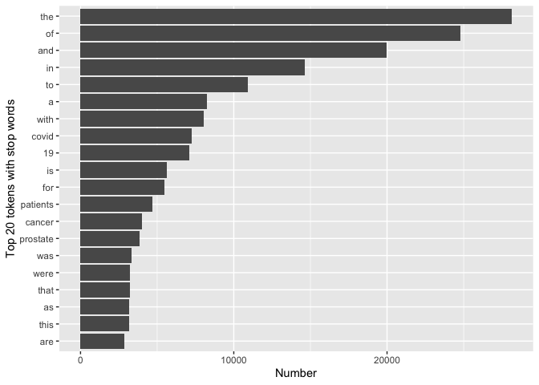

HW03
================
Yating Zeng

2022-10-31

# 1.APIs

## 1) Using the NCBI API, look for papers that show up under the term “sars-cov-2 trial vaccine.” Look for the data in the pubmed database, and then retrieve the details of the paper as shown in lab 7. How many papers were you able to find?

``` r
# Downloading the website
website <- xml2::read_html("https://pubmed.ncbi.nlm.nih.gov/?term=sars-cov-2+trial+vaccine")
# Finding the counts
counts <- xml2::xml_find_first(website, "/html/body/main/div[9]/div[2]/div[2]/div[1]/div[1]")
# Turning it into text
counts <- as.character(counts)
# Extracting the data using regex
stringr::str_extract(counts, "[0-9,]+")
```

    ## [1] "3,995"

``` r
stringr::str_extract(counts, "[[:digit:],]+")
```

    ## [1] "3,995"

``` r
stringr::str_replace(counts, "[^[:digit:]]+([[:digit:]]+),([[:digit:]]+)[^[:digit:]]+", "\\1\\2")
```

    ## [1] "3995"

## 2) Using the list of pubmed ids you retrieved, download each papers’ details using the query parameter rettype = abstract. If you get more than 250 ids, just keep the first 250.

``` r
query_ids <- GET(
  url   = "https://eutils.ncbi.nlm.nih.gov/entrez/eutils/esearch.fcgi",
  query = list(
    db      = "pubmed",
    term    = "sars-cov-2 trial vaccine",
    retmax  = 250
  ), 
)
# Extracting the content of the response of GET
ids <- httr::content(query_ids)
ids
```

    ## {xml_document}
    ## <eSearchResult>
    ## [1] <Count>1796</Count>
    ## [2] <RetMax>250</RetMax>
    ## [3] <RetStart>0</RetStart>
    ## [4] <IdList>\n  <Id>36307830</Id>\n  <Id>36305195</Id>\n  <Id>36301821</Id>\n ...
    ## [5] <TranslationSet>\n  <Translation>\n    <From>sars-cov-2</From>\n    <To>" ...
    ## [6] <TranslationStack>\n  <TermSet>\n    <Term>"sars-cov-2"[MeSH Terms]</Term ...
    ## [7] <QueryTranslation>("sars-cov-2"[MeSH Terms] OR "sars-cov-2"[All Fields] O ...

The Ids are wrapped around text in the following way: <Id>… id number
…</Id>. we can use a regular expression that extract that information.

``` r
# Turn the result into a character vector
ids <- as.character(ids)
# Find all the ids 
ids <- stringr::str_extract_all(ids, "<Id>[[:digit:]]+</Id>")[[1]]
# Remove all the leading and trailing <Id> </Id>. Make use of "|"
ids <- stringr::str_remove_all(ids, "</?Id>")
head(ids)
```

    ## [1] "36307830" "36305195" "36301821" "36299427" "36298743" "36287714"

## 3) As we did in lab 7. Create a dataset containing the following: Pubmed ID number, Title of the paper, Name of the journal where it was published, Publication date, and Abstract of the paper (if any).

``` r
publications <- GET(
  url   = "https://eutils.ncbi.nlm.nih.gov/",
  path  = "entrez/eutils/efetch.fcgi",
  query = list(
    db = "pubmed",
    id = I(paste(ids, collapse=",")),
    retmax = 250,
    rettype = "abstract"
    )
)
# Turning the output into character vector
publications <- httr::content(publications)
publications_txt <- as.character(publications)
```

``` r
pub_char_list <- xml2::xml_children(publications)
pub_char_list <- sapply(pub_char_list, as.character)
```

``` r
abstracts <- str_extract(pub_char_list, "<Abstract>[[:print:][:space:]]+</Abstract>")
abstracts <- str_remove_all(abstracts, "</?[[:alnum:]- =\"]+>")
abstracts <- str_replace_all(abstracts, "[[:space:]]+", " ")
```

``` r
titles <- str_extract(pub_char_list, "<ArticleTitle>[[:print:][:space:]]+</ArticleTitle>")
titles <- str_remove_all(titles, "</?[[:alnum:]- =\"]+>")
```

``` r
journal <- str_extract(pub_char_list, "<Title>[[:print:][:space:]]+</Title>")
journal <- str_remove_all(journal, "</?[[:alnum:]- =\"]+>")
journal <- str_remove_all(journal, "[\n]")
```

``` r
pubdate <- str_extract(pub_char_list, "<PubDate>[[:print:][:space:]]+</PubDate>")
pubdate <- str_remove_all(pubdate, "</?[[:alnum:]- =\"]+>")
pubdate <- str_remove_all(pubdate, "[\n]")
pubdate <- str_remove_all(pubdate, "[:space:]")
```

``` r
database <- data.frame(
  PubMedId = ids,
  Journal  = journal,
  PubDate  = pubdate,
  Title    = titles,
  Abstract = abstracts
)
summary <- knitr::kable(database[1:5,], align = "lccll",caption = "Some papers about sars-cov-2 trial vaccine") %>%
  column_spec(2, width = "10em") %>%
  column_spec(3, width = "7em") %>%
  column_spec(4, width = "30em") %>%
  kable_styling(bootstrap_options = c("striped", "hover"))
summary
```

<table class="table table-striped table-hover" style="margin-left: auto; margin-right: auto;">
<caption>
Some papers about sars-cov-2 trial vaccine
</caption>
<thead>
<tr>
<th style="text-align:left;">
PubMedId
</th>
<th style="text-align:center;">
Journal
</th>
<th style="text-align:center;">
PubDate
</th>
<th style="text-align:left;">
Title
</th>
<th style="text-align:left;">
Abstract
</th>
</tr>
</thead>
<tbody>
<tr>
<td style="text-align:left;">
36307830
</td>
<td style="text-align:center;width: 10em; ">
Trials
</td>
<td style="text-align:center;width: 7em; ">
2022Oct28
</td>
<td style="text-align:left;width: 30em; ">
Improving pediatric COVID-19 vaccine uptake using an mHealth tool
(MoVeUp): study protocol for a randomized, controlled trial.
</td>
<td style="text-align:left;">
Coronavirus disease 2019 (COVID-19) vaccines demonstrate excellent
effectiveness against infection, severe disease, and death. However,
pediatric COVID-19 vaccination rates lag among individuals from rural
and other medically underserved communities. The research objective of
the current protocol is to determine the effectiveness of a vaccine
communication mobile health (mHealth) application (app) on parental
decisions to vaccinate their children against COVID-19. Custodial
parents/caregivers with ≥ 1 child eligible for COVID-19 vaccination who
have not yet received the vaccine will be randomized to download one of
two mHealth apps. The intervention app will address logistical and
motivational barriers to pediatric COVID-19 vaccination. Participants
will receive eight weekly push notifications followed by two monthly
push notifications (cues to action) regarding vaccinating their child.
Through branching logic, users will access customized content based on
their locality, degree of rurality-urbanicity, primary language
(English/Spanish), race/ethnicity, and child’s age to address COVID-19
vaccine knowledge and confidence gaps. The control app will provide push
notifications and information on general pediatric health and infection
prevention and mitigation strategies based on recommendations from the
American Academy of Pediatrics (AAP) and the Centers for Disease Control
and Prevention (CDC). The primary outcome is the proportion of children
who complete COVID-19 vaccination series. Secondary outcomes include the
proportion of children who receive ≥ 1 dose of COVID-19 vaccine and
changes in parent/caregiver scores from baseline to immediately
post-intervention on the modified WHO SAGE Vaccine Hesitancy Scale
adapted for the COVID-19 vaccine. The COVID-19 pandemic inflicts
disproportionate harm on individuals from underserved communities,
including those in rural settings. Maximizing vaccine uptake in these
communities will decrease infection rates, severe illness, and death.
Given that most US families from these communities use smart phones,
mHealth interventions hold the promise of broad uptake. Bundling
multiple mHealth vaccine uptake interventions into a single app may
maximize the impact of deploying such a tool to increase COVID-19
vaccination. The new knowledge to be gained from this study will
directly inform future efforts to increase COVID-19 vaccination rates
across diverse settings and provide an evidentiary base for app-based
vaccine communication tools that can be adapted to future
vaccine-deployment efforts. ClinicalTrials.gov NCT05386355 . Registered
on May 23, 2022. © 2022. The Author(s).
</td>
</tr>
<tr>
<td style="text-align:left;">
36305195
</td>
<td style="text-align:center;width: 10em; ">
Journal of biomolecular structure &amp; dynamics
</td>
<td style="text-align:center;width: 7em; ">
2022Oct28
</td>
<td style="text-align:left;width: 30em; ">
Deep learning in drug discovery: a futuristic modality to materialize
the large datasets for cheminformatics.
</td>
<td style="text-align:left;">
Artificial intelligence (AI) development imitates the workings of the
human brain to comprehend modern problems. The traditional approaches
such as high throughput screening (HTS) and combinatorial chemistry are
lengthy and expensive to the pharmaceutical industry as they can only
handle a smaller dataset. Deep learning (DL) is a sophisticated AI
method that uses a thorough comprehension of particular systems. The
pharmaceutical industry is now adopting DL techniques to enhance the
research and development process. Multi-oriented algorithms play a
crucial role in the processing of QSAR analysis, de novo drug design,
ADME evaluation, physicochemical analysis, preclinical development,
followed by clinical trial data precision. In this study, we
investigated the performance of several algorithms, including deep
neural networks (DNN), convolutional neural networks (CNN) and
multi-task learning (MTL), with the aim of generating high-quality,
interpretable big and diverse databases for drug design and development.
Studies have demonstrated that CNN, recurrent neural network and deep
belief network are compatible, accurate and effective for the molecular
description of pharmacodynamic properties. In Covid-19, existing
pharmacological compounds has also been repurposed using DL models. In
the absence of the Covid-19 vaccine, remdesivir and oseltamivir have
been widely employed to treat severe SARS-CoV-2 infections. In
conclusion, the results indicate the potential benefits of employing the
DL strategies in the drug discovery process. Communicated by Ramaswamy
H. Sarma.
</td>
</tr>
<tr>
<td style="text-align:left;">
36301821
</td>
<td style="text-align:center;width: 10em; ">
PLoS medicine
</td>
<td style="text-align:center;width: 7em; ">
2022Oct
</td>
<td style="text-align:left;width: 30em; ">
Immunogenicity and reactogenicity of SARS-CoV-2 vaccines in people
living with HIV in the Netherlands: A nationwide prospective cohort
study.
</td>
<td style="text-align:left;">
Vaccines can be less immunogenic in people living with HIV (PLWH), but
for SARS-CoV-2 vaccinations this is unknown. In this study we set out to
investigate, for the vaccines currently approved in the Netherlands, the
immunogenicity and reactogenicity of SARS-CoV-2 vaccinations in PLWH. We
conducted a prospective cohort study to examine the immunogenicity of
BNT162b2, mRNA-1273, ChAdOx1-S, and Ad26.COV2.S vaccines in adult PLWH
without prior COVID-19, and compared to HIV-negative controls. The
primary endpoint was the anti-spike SARS-CoV-2 IgG response after mRNA
vaccination. Secondary endpoints included the serological response after
vector vaccination, anti-SARS-CoV-2 T-cell response, and reactogenicity.
Between 14 February and 7 September 2021, 1,154 PLWH (median age 53
\[IQR 44-60\] years, 85.5% male) and 440 controls (median age 43 \[IQR
33-53\] years, 28.6% male) were included in the final analysis. Of the
PLWH, 884 received BNT162b2, 100 received mRNA-1273, 150 received
ChAdOx1-S, and 20 received Ad26.COV2.S. In the group of PLWH, 99% were
on antiretroviral therapy, 97.7% were virally suppressed, and the median
CD4+ T-cell count was 710 cells/μL (IQR 520-913). Of the controls, 247
received mRNA-1273, 94 received BNT162b2, 26 received ChAdOx1-S, and 73
received Ad26.COV2.S. After mRNA vaccination, geometric mean antibody
concentration was 1,418 BAU/mL in PLWH (95% CI 1322-1523), and after
adjustment for age, sex, and vaccine type, HIV status remained
associated with a decreased response (0.607, 95% CI 0.508-0.725, p &lt;
0.001). All controls receiving an mRNA vaccine had an adequate response,
defined as &gt;300 BAU/mL, whilst in PLWH this response rate was 93.6%.
In PLWH vaccinated with mRNA-based vaccines, higher antibody responses
were predicted by CD4+ T-cell count 250-500 cells/μL (2.845, 95% CI
1.876-4.314, p &lt; 0.001) or &gt;500 cells/μL (2.936, 95% CI
1.961-4.394, p &lt; 0.001), whilst a viral load &gt; 50 copies/mL was
associated with a reduced response (0.454, 95% CI 0.286-0.720, p =
0.001). Increased IFN-γ, CD4+ T-cell, and CD8+ T-cell responses were
observed after stimulation with SARS-CoV-2 spike peptides in ELISpot and
activation-induced marker assays, comparable to controls. Reactogenicity
was generally mild, without vaccine-related serious adverse events. Due
to the control of vaccine provision by the Dutch National Institute for
Public Health and the Environment, there were some differences between
vaccine groups in the age, sex, and CD4+ T-cell counts of recipients.
After vaccination with BNT162b2 or mRNA-1273, anti-spike SARS-CoV-2
antibody levels were reduced in PLWH compared to HIV-negative controls.
To reach and maintain the same serological responses as HIV-negative
controls, additional vaccinations are probably required. The trial was
registered in the Netherlands Trial Register (NL9214).
<https://www.trialregister.nl/trial/9214>.
</td>
</tr>
<tr>
<td style="text-align:left;">
36299427
</td>
<td style="text-align:center;width: 10em; ">
medRxiv : the preprint server for health sciences
</td>
<td style="text-align:center;width: 7em; ">
2022Oct18
</td>
<td style="text-align:left;width: 30em; ">
Fluvoxamine for Outpatient Treatment of COVID-19: A Decentralized,
Placebo-controlled, Randomized, Platform Clinical Trial.
</td>
<td style="text-align:left;">
The effectiveness of fluvoxamine to shorten symptom duration or prevent
hospitalization among outpatients in the US with mild to moderate
symptomatic coronavirus disease 2019 (COVID-19) is unclear. ACTIV-6 is
an ongoing, decentralized, double-blind, randomized, placebo-controlled
platform trial testing repurposed medications in outpatients with mild
to moderate COVID-19. A total of 1288 non-hospitalized adults aged ≥30
years with confirmed COVID-19 experiencing ≥2 symptoms of acute
infection for ≤7 days prior to randomization were randomized to receive
fluvoxamine 50 mg or placebo twice daily for 10 days. The primary
outcome was time to sustained recovery, defined as the third of 3
consecutive days without symptoms. Secondary outcomes included
composites of hospitalization or death with or without urgent or
emergency care visit by day 28. Of 1331 participants randomized (mean
\[SD\] age, 48.5 \[12.8\] years; 57% women; 67% reported receiving at
least 2 doses of a SARS-CoV-2 vaccine), 1288 completed the trial (n=614
placebo, n=674 fluvoxamine). Median time to recovery was 13 days (IQR
12-13) in the placebo group and 12 days (IQR 11-14) in the fluvoxamine
group (hazard ratio \[HR\] 0.96, 95% credible interval \[CrI\]
0.86-1.07; posterior probability for benefit \[HR&gt;1\]=0.22).
Twenty-six participants (3.9%) in the fluvoxamine group were
hospitalized or had urgent or emergency care visits compared with 23
(3.8%) in the placebo group (HR 1.1, 95% CrI 0.6-1.8; posterior
probability for benefit \[HR&lt;1\]=0.340). One participant in the
fluvoxamine group and 2 in the placebo group were hospitalized; no
deaths occurred. Adverse events were uncommon in both groups. Treatment
with fluvoxamine 50 mg twice daily for 10 days did not improve time to
recovery, compared with placebo, among outpatients with mild to moderate
COVID-19. These findings do not support the use of fluvoxamine at this
dose and duration in patients with mild to moderate COVID-19.
</td>
</tr>
<tr>
<td style="text-align:left;">
36298743
</td>
<td style="text-align:center;width: 10em; ">
Viruses
</td>
<td style="text-align:center;width: 7em; ">
2022Oct04
</td>
<td style="text-align:left;width: 30em; ">
Immunogenicity, Safety, and Anti-Viral Efficacy of a Subunit SARS-CoV-2
Vaccine Candidate in Captive Black-Footed Ferrets (Mustela nigripes) and
Their Susceptibility to Viral Challenge.
</td>
<td style="text-align:left;">
A preliminary vaccination trial against the emergent pathogen,
SARS-CoV-2, was completed in captive black-footed ferrets (Mustela
nigripes; BFF) to assess safety, immunogenicity, and anti-viral
efficacy. Vaccination and boosting of 15 BFF with purified SARS-CoV-2 S1
subunit protein produced a nearly 150-fold increase in mean antibody
titers compared to pre-vaccination titers. Serum antibody responses were
highest in young animals, but in all vaccinees, antibody response
declined rapidly. Anti-viral activity from vaccinated and unvaccinated
BFF was determined in vitro, as well as in vivo with a passive serum
transfer study in mice. Transgenic mice that received BFF serum
transfers and were subsequently challenged with SARS-CoV-2 had lung
viral loads that negatively correlated (p &amp;lt; 0.05) with the BFF
serum titer received. Lastly, an experimental challenge study in a small
group of BFF was completed to test susceptibility to SARS-CoV-2. Despite
viral replication and shedding in the upper respiratory tract for up to
7 days post-challenge, no clinical disease was observed in either
vaccinated or naive animals. The lack of morbidity or mortality observed
indicates SARS-CoV-2 is unlikely to affect wild BFF populations, but
infected captive animals pose a potential risk, albeit low, for humans
and other animals.
</td>
</tr>
</tbody>
</table>

# 2. Text mining

A new dataset has been added to the data science data repository
<https://github.com/USCbiostats/data-science->
data/tree/master/03_pubmed. The dataset contains 3241 abstracts from
articles across 5 search terms. Your job is to analyse these abstracts
to find interesting insights.

``` r
library(tidytext)
```

    ## Warning: package 'tidytext' was built under R version 4.1.2

``` r
library(ggplot2)

library(tidyverse)
library(dtplyr)
```

    ## Warning: package 'dtplyr' was built under R version 4.1.2

``` r
library(forcats)
```

### Read in the data

First download and then read in with read.csv()

``` r
if (!file.exists("pubmed.csv")){
  download.file("https://raw.githubusercontent.com/USCbiostats/data-science-data/master/03_pubmed/pubmed.csv", "pubmed.csv", method="libcurl", timeout = 60)
}

pub <- read.csv("pubmed.csv")
str(pub)
```

    ## 'data.frame':    3241 obs. of  2 variables:
    ##  $ abstract: chr  "Background and aims: Many patients with coronavirus disease 2019 (COVID-19) have underlying cardiovascular (CV)"| __truncated__ "Introduction: Contradictory data have been reported on the incidence of stroke in patients with COVID-19 and th"| __truncated__ "This article aims at collecting all information needed for dentists regarding the COVID-19 pandemic throughout "| __truncated__ "OBJECTIVE. The objective of our study was to determine the misdiagnosis rate of radiologists for coronavirus di"| __truncated__ ...
    ##  $ term    : chr  "covid" "covid" "covid" "covid" ...

``` r
pub <- as_tibble(pub)
pub
```

    ## # A tibble: 3,241 × 2
    ##    abstract                                                                term 
    ##    <chr>                                                                   <chr>
    ##  1 "Background and aims: Many patients with coronavirus disease 2019 (COV… covid
    ##  2 "Introduction: Contradictory data have been reported on the incidence … covid
    ##  3 "This article aims at collecting all information needed for dentists r… covid
    ##  4 "OBJECTIVE. The objective of our study was to determine the misdiagnos… covid
    ##  5 "Background: Much of the focus regarding the global pandemic of corona… covid
    ##  6 "The World Health Organization (WHO) has issued a warning that, althou… covid
    ##  7 "The coronavirus disease (COVID-19) has spread all around the world in… covid
    ##  8 "Objective: The novel severe acute respiratory syndrome coronavirus 2 … covid
    ##  9 "COVID-19 has been declared a global pandemic by the World Health Orga… covid
    ## 10 "Background: Coronavirus disease 2019 (COVID-19) is a novel infectious… covid
    ## # … with 3,231 more rows

## 1) Tokenize the abstracts and count the number of each token. Do you see anything interesting? Does removing stop words change what tokens appear as the most frequent? What are the 5 most common tokens for each search term after removing stopwords?

``` r
pub %>%
  unnest_tokens(token, abstract) %>%
  count(token, sort = TRUE) %>%
  top_n(20, n) %>%
  ggplot(aes(n, fct_reorder(token, n))) +
  labs(x = "Number", y = "Top 20 tokens with stop words") +
  geom_col()
```

<!-- -->

We could find that most the word with high frequency are the stop words.
15 of the top 20 common tokens, especially the top 5, are all stop
words. The other 5 tokens with frequency increased by the order are
“covid”, “19”, “patients”, “cancer”, and “prostate”. Considering “covid”
and “19” are usually used together, this results make sense.

``` r
pub %>%
  unnest_tokens(token, abstract) %>%
  anti_join(stop_words, by = c("token" = "word")) %>%
  count(token, sort = TRUE) %>%
  #use regular 
  filter(!grepl(pattern = "^[0-9]+$", x = token)) %>%
  top_n(5, n) %>%
  ggplot(aes(n, fct_reorder(token, n))) +
  labs(x = "Number", y = "Top 5 tokens without stop words") +
  geom_col()
```

<!-- -->

Considering “covid” and “19” are usually used together, we could also
remove the number when we remove the stop words to observe the common
words better. After removing process, the result the top 5 tokens with
high frequency are all non stop-word, which are the same one mentioned
above,“covid”, “patients”, “cancer”, “prostate” and a new one “disease”.

## 2) Tokenize the abstracts into bigrams. Find the 10 most common bigram and visualize them with ggplot2.

``` r
pub %>%
  unnest_ngrams(bigram, abstract, n=2) %>%
  count(bigram, sort = TRUE) %>%
  top_n(10, n) %>%
  ggplot(aes(n, fct_reorder(bigram, n))) +
  labs(x = "Number", y = "Top 10 bi-gram tokens")  +
  geom_col()
```

<!-- -->

The 10 most common bi-gram are shown above, “covid 19” are much more
than the others. And nearly all the most 10 common bi-gram are the
combination of the 20 most common tokens we gained before without
removing the stop words and the number.

## 3) Calculate the TF-IDF value for each word-search term combination. (here you want the search term to be the “document”) What are the 5 tokens from each search term with the highest TF-IDF value? How are the results different from the answers you got in question 1?

``` r
#tokens with stop words and number
pub %>%
  unnest_tokens(token, abstract) %>%
  count(token, term) %>%
  bind_tf_idf(token, term, n) %>%
  arrange(desc(tf_idf)) %>%
  top_n(5, tf_idf)
```

    ## # A tibble: 5 × 6
    ##   token        term                n      tf   idf tf_idf
    ##   <chr>        <chr>           <int>   <dbl> <dbl>  <dbl>
    ## 1 covid        covid            7275 0.0371   1.61 0.0597
    ## 2 prostate     prostate cancer  3832 0.0312   1.61 0.0502
    ## 3 eclampsia    preeclampsia     2005 0.0143   1.61 0.0230
    ## 4 preeclampsia preeclampsia     1863 0.0133   1.61 0.0214
    ## 5 meningitis   meningitis        429 0.00919  1.61 0.0148

``` r
#token without stop words and number
pub %>%
  unnest_tokens(token, abstract) %>%
  anti_join(stop_words, by = c("token" = "word")) %>%
  filter(!grepl(pattern = "^[0-9]+$", x = token)) %>%
  count(token, term) %>%
  bind_tf_idf(token, term, n) %>%
  arrange(desc(tf_idf)) %>%
  top_n(5, tf_idf)
```

    ## # A tibble: 5 × 6
    ##   token        term                n     tf   idf tf_idf
    ##   <chr>        <chr>           <int>  <dbl> <dbl>  <dbl>
    ## 1 covid        covid            7275 0.0722  1.61 0.116 
    ## 2 prostate     prostate cancer  3832 0.0577  1.61 0.0929
    ## 3 eclampsia    preeclampsia     2005 0.0267  1.61 0.0429
    ## 4 preeclampsia preeclampsia     1863 0.0248  1.61 0.0399
    ## 5 meningitis   meningitis        429 0.0172  1.61 0.0278

``` r
#bi-grams with stop words and number
pub %>%
  unnest_ngrams(bigram, abstract, n=2) %>%
  count(bigram, term) %>%
  bind_tf_idf(bigram, term, n) %>%
  arrange(desc(tf_idf)) %>%
  top_n(5, tf_idf)
```

    ## # A tibble: 5 × 6
    ##   bigram          term                n      tf   idf tf_idf
    ##   <chr>           <chr>           <int>   <dbl> <dbl>  <dbl>
    ## 1 covid 19        covid            6969 0.0357  1.61  0.0575
    ## 2 prostate cancer prostate cancer  3222 0.0264  1.61  0.0425
    ## 3 pre eclampsia   preeclampsia     1854 0.0133  1.61  0.0214
    ## 4 cystic fibrosis cystic fibrosis   859 0.0176  0.916 0.0161
    ## 5 of covid        covid            1519 0.00779 1.61  0.0125

Not matter removing the stop words and the number ore not, the 5 tokens
with highest tf_idf value of both are the same, which are “covid”,
“prostate”, “eclampsia”, “preeclampsia”, and “meningitis”. For the
bi-grams, the 5 tokens with highest tf_idf value are “covid
19”,“prostate cancer”,“pre eclampsia”,“cystic fibrosis”, and “of covid”.
Comparing with the 5 common tokens in question 1, “covid”, “patients”,
“cancer”, “prostate” and “disease”, the 5 tokens with highest tf_idf
value here are prtly different, with only “covid” and “prostate” are the
same. Besides, the 5 tokens with highest tf_idf value (“eclampsia”,
“preeclampsia”, and “meningitis”) provide more specific and useful
information on learning about the research results than the 5 common
tokens with highest frequency (“patients”, “cancer”, and “disease”.
